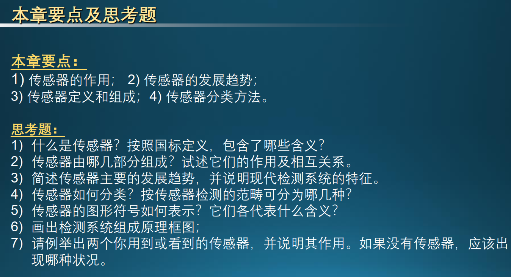
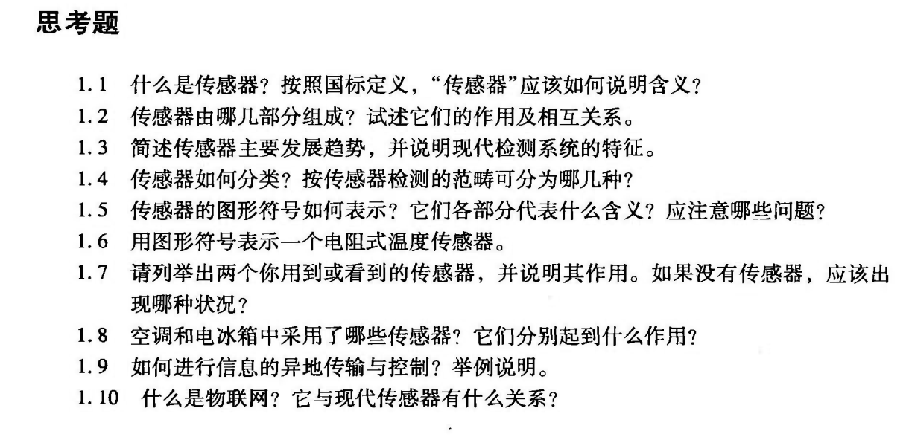

# 《机器人传感器与执行器》

# 《机器人传感器与执行器》

-  传感器课程考核方式：期末70%+平时成绩30%

　　**本地资料路径👇**

　　[《机器人传感器与执行器》](F:\ECUST\《机器人传感器与执行器》)

　　手写笔记扫描[^1]

　　这份复习计划以你提供的**三次作业**为金标准，结合14个章节的PPT重点和实验报告内容制定。老师提到难度与作业相当，意味着**基本定义、工作原理对比以及作业中出现的计算题**是重中之重。

　　以下是为你制定的**两周复习计划**及​**详细复习重点**：

### 第一阶段：基础理论与经典传感器（第1-7天）

- **第1天：第1章 传感器概述**

  - **重点：**  传感器的定义（国标）、组成（敏感元件、转换元件、测量电路）、分类（按检测范畴）。
  - **作业考点：**  现代信息技术三大支柱及其作用；**2026年春晚宇树人形机器人**中传感器的应用及其作用。

- **第2天：第2章 传感器特性**

  - **重点：**  静态指标（灵敏度、分辨率、稳定性等）；动态特性（传递函数、频率响应）。
  - **必考计算：**  根据微分方程求**时间常数 \$\\tau\$**  和​**静态灵敏度 \$k\$** ​；阶跃响应下的​**动态误差计算**。
- **第3天：第3章 电阻式传感器**

  - **重点：**  电阻应变效应；应变片灵敏系数与丝材灵敏系数的区别；横向效应及其减小方法。
  - **必考计算：**  ​**直流电桥输出电压计算**（单臂、半桥、全桥的输出公式及灵敏度对比）。
- **第4天：第4章 热电式传感器**

  - **重点：**  热电效应；热电偶测温回路的组成（接触电势、温差电势）；​**参考端补偿**；热电阻（Pt100）工作原理。
  - **作业考点：**  理解分度表的使用；常用热电偶名词解释。
- **第5天：第5章 电容式传感器**

  - **重点：**  变间隙式、变面积式、变介电常数式的工作原理。
  - **必考计算：**  不同间距下的电容值 \$C\$ 及其**相对变化量 \$\\Delta C/C\$**  的计算。
- **第6天：第6章 电感式传感器**

  - **重点：**  自感式（变气隙、差动）与互感式（差动变压器LVDT）；**电涡流效应**的工作原理及物理模型。
  - **对比：**  单线圈与差动式性能指标的异同。
- **第7天：周复习与计算专题**

  - **任务：**  重新闭卷练习前六章作业中的所有计算题。特别是**电桥平衡和动态误差**相关题目。

### 第二阶段：先进传感器与综合应用（第8-14天）

- **第8天：第7章 磁电与磁敏式传感器**

  - **重点：**  磁电感应式原理；**霍尔效应**及其材料选择（为什么不用金属？）。
  - **必考计算：**  霍尔电势 \$U\_H\$ 计算及载流子浓度计算。
  - **对比：**  霍尔元件、磁敏电阻、磁敏晶体管的特点对比。
- **第9天：第8章 压电式传感器**

  - **重点：**  正/逆压电效应定义；压电元件的**串联与并联**接法（电压、电荷、电容的关系及应用场合）。
  - **重点对比：**  **电压放大器与电荷放大器**的本质区别、特点及适用场合。
- **第10天：第9章 光电效应及光电器件**

  - **重点：**  ​**外光电效应与内光电效应**（光电导、光生伏特）的区别及典型器件（光敏电阻、二极管、光电池）。
  - **应用：**  光电开关在智能小车中的应用（寻迹、避障、测速电路）。
- **第11天：第10章 光电式传感器（光纤/光栅）**

  - **重点：**  CCD的组成及输出信号特点；光纤传光原理；光栅传感器原理与​**莫尔条纹**。
  - **必考计算：**  光纤最大入射角 \$\\theta\_c\$ 的计算（数值孔径相关）。
- **第12天：第11章 波与辐射式传感器（超声波/红外/微波）**

  - **重点：**  超声波发射与接收利用的效应（压电效应）；红外辐射探测器类型（热/光子探测器）。
  - **必考计算：**  ​**超声波测厚/测距**（利用声速和时间间隔计算厚度）。
- **第13天：第12-14章 射线、化学与生物传感器**

  - **重点：**  核辐射探测器种类及应用；气敏/湿敏/离子敏传感器基本概念。
  - **注意：**  这部分在作业中占比较小，建议以PPT中的“本章要点”和基本定义为主。
- **第14天：实验回顾与全真模拟**

  - **任务：**  快速扫视**实验报告**中的标定曲线（如LVDT、霍尔传感器、电涡流的线性范围）。
  - **模拟：**  将三次作业合成一张试卷，模拟考场环境在2小时内完成，查漏补缺。

### 详细复习重点总结（金标准）：

1. **基本概念辨析：**  标定与校准的区别；电压放大器与电荷放大器的区别；内外光电效应的区别。
2. **核心计算题型：**

   - **传感器动态误差：**  \$\\tau\_0 \\frac{dt\_2}{d\\tau} + t\_2 \= t\_1\$ 型方程的求解。
   - **应变电桥计算：**  灵活计算各臂阻值变化对输出电压的影响。
   - **物理量计算：**  霍尔电势（\$U\_H \= K\_H I B\$）、超声波距离（\$L \= vt/2\$）、光纤全反射角。
3. **结构与原理：**  差动变压器（LVDT）的零位核电气零点；光栅传感器为什么精度高（莫尔条纹的放大作用）。

　　按照这个节奏复习，每天PPT结合对应的作业题目，能够保证你对期末考考点的全面覆盖。祝你考试顺利！

　　测试修改

[^1]: # 手写笔记扫描

    # 第一章 传感器概述

    

    ‍
