# 线性代数

- 线代笔记存档[^1]

  - 第一章 行列式[^2]
  - 第二章 矩阵[^3]

    - 矩阵的逆：性质整理[^5]
    - 由矩阵A=A^2可以得到什么[^4]
  - 第三章 向量[^6]

    - 证明线性无关常见的方法总结[^7]
    - 向量空间与基[^8]
    - 旧向量的线性组合构成新向量组题型[^9]
  - 第四章 线性方程组[^10]

    - 线性方程组的几何意义[^11]
    - 行满秩与列满秩速判讲义[^12]
    - 🌟🌟同解经典例题（重要）[^13]
  - 第五章 特征值与特征向量[^14]
  - 第六章 二次型[^15]
- 线性代数的几何意义[^16]
- 线代强化复习参考[^17]

　　‍

[^1]: # 线代笔记存档

    - [第一章 行列式](siyuan://blocks/20260514203914-jvr3umo)
    - [第二章 矩阵](siyuan://blocks/20260514203948-7of3pc1)

      - [矩阵的逆：性质整理](siyuan://blocks/20260501174912-ehcmols)
    - [第三章 向量](siyuan://blocks/20260514204019-6pymfe1)
    - [第四章 线性方程组](siyuan://blocks/20260514204041-zf26g0r)
    - [第五章 特征值与特征向量](siyuan://blocks/20260514204107-jyfbcf8)
    - [第六章 二次型](siyuan://blocks/20260514204147-c0a8z7a)

    ‍

[^2]: # 第一章 行列式

    # 笔记整理总结

    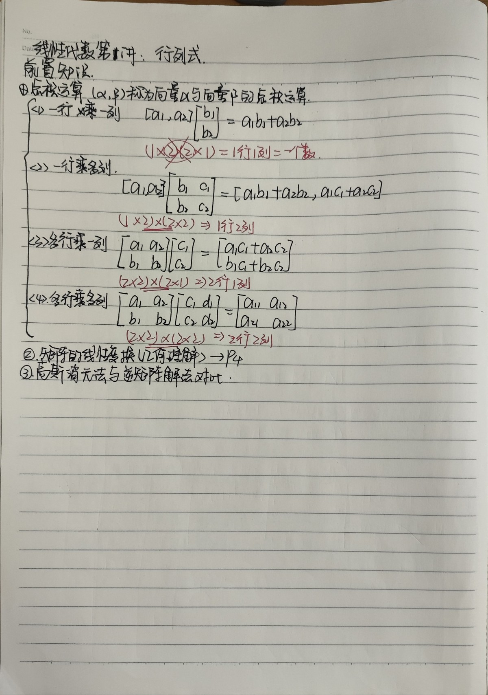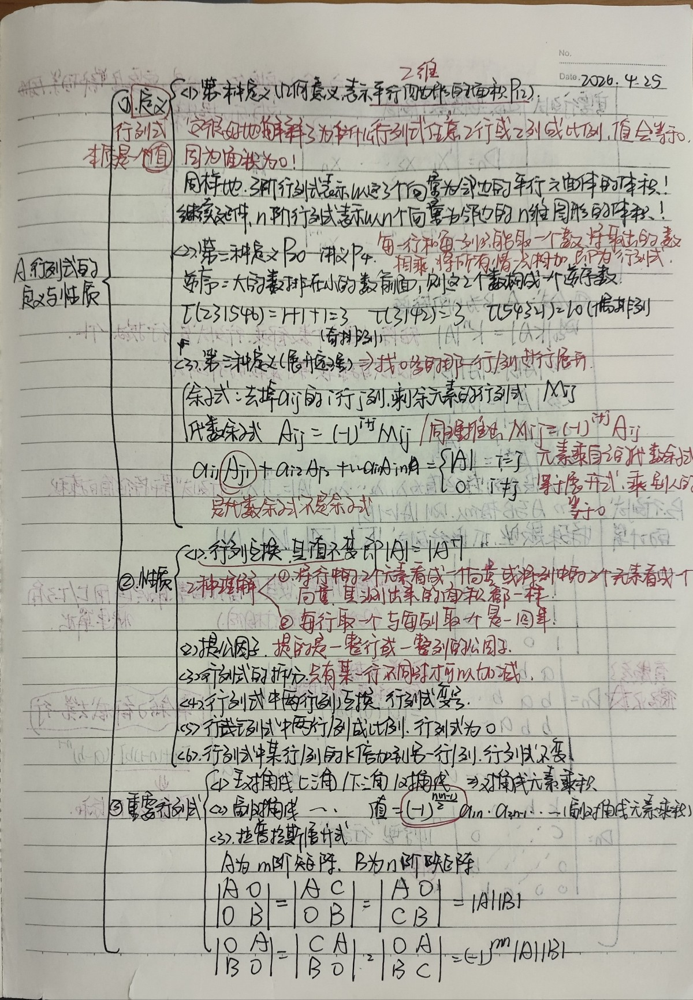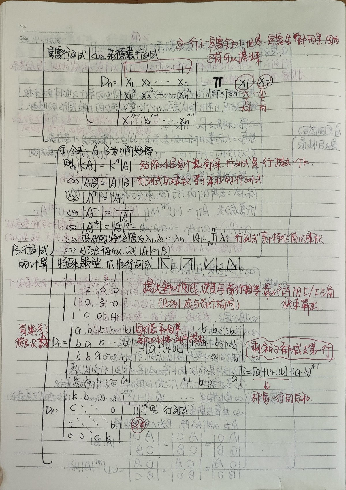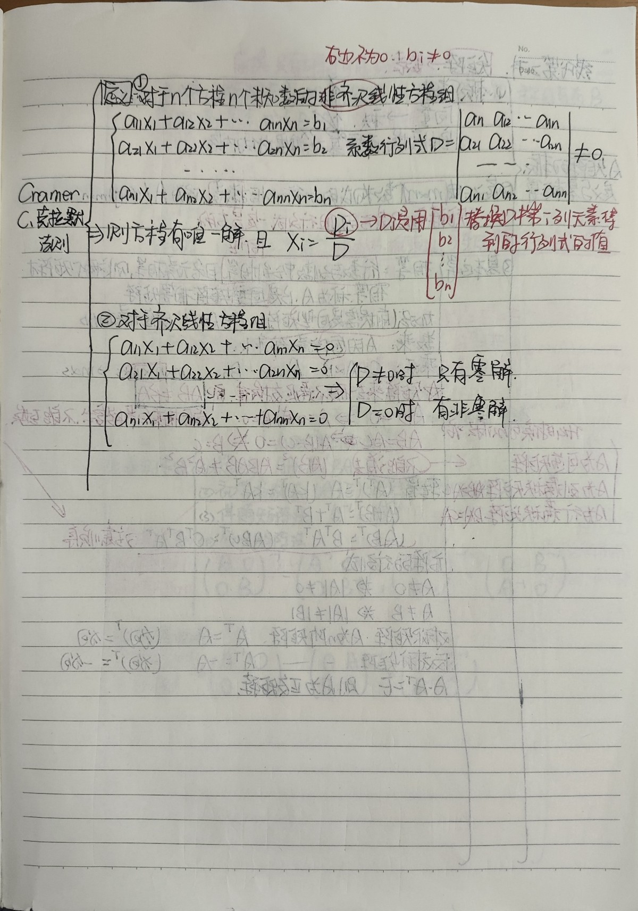

    以三阶行列式为例,D3≠0，则三个向量张开的体积不为0，则三个对应向量线性无关

                                D3=0，则对应的体积为0，三个向量对应线性相关。说明这三个向量共线或者共面

    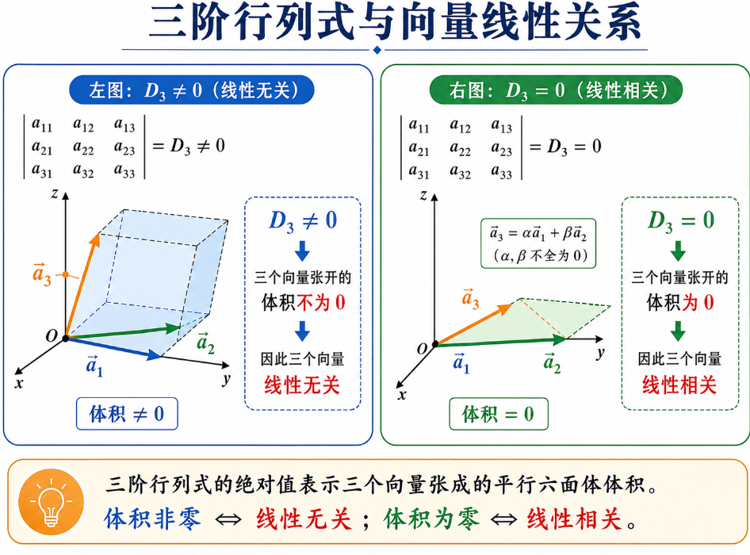

    # 重要题型

    ## 1️⃣三对角行列式

    三对角行列式（也叫“川字形行列式”）其实是考研线代里一个非常重要的模型。你会发现它表面看起来复杂，但本质上只有一个核心：

    > **利用结构递推降维。**
    >

    因为它除了主对角线和两条邻对角线之外全是 0，所以展开时会出现非常规律的递推关系。

    ---

    # 一、什么是三对角（川字形）行列式

    典型长这样：

    $$
    D_n=
    \begin{vmatrix}
    a_1 & b_1 & 0 & 0 & \cdots &0\\
    c_1 & a_2 & b_2 & 0 & \cdots &0\\
    0 & c_2 & a_3 & b_3 & \cdots &0\\
    \vdots & & \ddots & \ddots & \ddots & \vdots\\
    0&\cdots&0&c_{n-1}&a_n
    \end{vmatrix}
    $$

    只在：

    - 主对角线
    - 上一条副对角线
    - 下一条副对角线

    有元素。

    所以像一个“川”字。

    ---

    # 二、核心思想（第一性原理）

    你可以想：

    ## 普通行列式为什么难？

    因为：

    $$
    n!
    $$

    项太多。

    ---

    ## 三对角为什么简单？

    因为大量元素是 0。

    导致：

    - 很多排列直接消失
    - 按行展开时只剩 2 项
    - 最终形成递推

    所以：

    > 三对角行列式本质是：
    >
    >  **“结构化稀疏矩阵 → 递推数列问题”**
    >

    这就是它的底层逻辑。

    ---

    # 三、最核心的方法：递推法（必会）

    这是绝对主力。

    ---

    ## 经典模型

    $$
    D_n=
    \begin{vmatrix}
    a & b & 0 & \cdots &0\\
    c & a & b & \cdots &0\\
    0 & c & a & \ddots &0\\
    \vdots&&\ddots&\ddots&b\\
    0&0&0&c&a
    \end{vmatrix}
    $$

    ---

    ## Step1：按第一行展开

    由于第一行只有两个非零元素：

    $$
    D_n
    =
    aD_{n-1}
    -
    bcD_{n-2}
    $$

    得到：

    $$
    \boxed{
    D_n=aD_{n-1}-bcD_{n-2}
    }
    $$

    这就是灵魂。

    ---

    ## Step2：初值

    通常：

    $$
    D_1=a
    $$

    $$
    D_2=
    \begin{vmatrix}
    a&b\\
    c&a
    \end{vmatrix}
    =a^2-bc
    $$

    ---

    ## Step3：解递推

    于是问题变成数列。

    ---

    # 四、最常见的几种类型

    ---

    # 类型1：常系数三对角（考研最爱）

    例如：

    $$
    \begin{vmatrix}
    2&-1&0&0\\
    -1&2&-1&0\\
    0&-1&2&-1\\
    0&0&-1&2
    \end{vmatrix}
    $$

    ---

    ## 递推：

    $$
    D_n=2D_{n-1}-D_{n-2}
    $$

    初值：

    $$
    D_1=2,\quad D_2=3
    $$

    算几个：

    $$
    D_3=4
    $$

    $$
    D_4=5
    $$

    发现：

    $$
    \boxed{D_n=n+1}
    $$

    这是经典模板题。

    ---

    # 类型2：主对角不同

    例如：

    $$
    D_n=
    \begin{vmatrix}
    x&1&0\\
    1&x&1\\
    0&1&x
    \end{vmatrix}
    $$

    递推：

    $$
    D_n=xD_{n-1}-D_{n-2}
    $$

    这是考特征值特别常见的。

    ---

    # 类型3：出现斐波那契

    例如：

    $$
    D_n=
    \begin{vmatrix}
    1&1&0\\
    1&1&1\\
    0&1&1
    \end{vmatrix}
    $$

    递推可能变成：

    $$
    D_n=D_{n-1}-D_{n-2}
    $$

    或者：

    $$
    D_n=D_{n-1}+D_{n-2}
    $$

    这时候直接联想到 Fibonacci。

    ---

    # 五、除了递推，还有哪些方法？

    ---

    # 方法2：行变换（适合特殊结构）

    有些题可以通过：

    - 某行加到另一行
    - 化成上三角

    快速求。

    例如：

    $$
    \begin{vmatrix}
    1&1&0&0\\
    -1&1&1&0\\
    0&-1&1&1\\
    0&0&-1&1
    \end{vmatrix}
    $$

    你会发现：

    - 上下有规律
    - 可以消元

    最后变上三角。

    ---

    ## 本质

    其实还是：

    > 利用稀疏结构降低复杂度。
    >

    ---

    # 方法3：特征值法（高阶）

    某些：

    $$
    A_n=
    \begin{pmatrix}
    2&-1\\
    -1&2
    \end{pmatrix}
    $$

    型矩阵。

    可以：

    - 求特征值
    - determinant \= 特征值乘积

    ---

    例如经典：

    $$
    \lambda_k
    =
    2-2\cos\frac{k\pi}{n+1}
    $$

    于是：

    $$
    |A|=\prod \lambda_k
    $$

    这个偏数学系。

    考研一般不用硬做。

    ---

    # 方法4：公式记忆（不推荐死记）

    有经典结论：

    ---

    ## Toeplitz 三对角

    $$
    D_n=
    \frac{\lambda_1^{n+1}-\lambda_2^{n+1}}
    {\lambda_1-\lambda_2}
    $$

    其中：

    $$
    \lambda^2-a\lambda+bc=0
    $$

    是特征方程根。

    ---

    但其实：

    你会递推就够了。

    没必要死背。

    ---

    # 六、考研真正怎么考？

    重点就两个：

    ---

    ## ① 建递推

    看到川字形：

    第一反应：

    $$
    D_n=aD_{n-1}-bcD_{n-2}
    $$

    ---

    ## ② 猜规律

    算：

    $$
    D_1,D_2,D_3,D_4
    $$

    观察：

    - 等差
    - 等比
    - Fibonacci
    - 周期

    ---

    # 七、一个非常重要的理解 🌟

    很多人学三对角行列式时：

    是在“记公式”。

    但真正重要的是：

    ---

    # 行列式 ≠ 纯计算

    它其实在描述：

    $$
    \text{线性耦合关系}
    $$

    三对角矩阵意味着：

    > 每个变量只和相邻变量发生关系。
    >

    这在：

    - 弹簧系统
    - 电路
    - 差分方程
    - 数值分析
    - 图像处理
    - 有限元
    - 控制系统

    里都极其常见。

    你以后做控制工程、机器人、卡尔曼滤波时，会疯狂看到这种结构。

    ---

    # 八、最后给你一个“万能模板”

    看到三对角：

    ---

    ## 第一步

    设：

    $$
    D_n=
    \begin{vmatrix}
    \cdots
    \end{vmatrix}
    $$

    ---

    ## 第二步

    按第一行（或最后一行）展开：

    因为只有两个非零项：

    $$
    \boxed{
    D_n=a_nD_{n-1}-b_{n-1}c_{n-1}D_{n-2}
    }
    $$

    ---

    ## 第三步

    求：

    $$
    D_1,D_2
    $$

    ---

    ## 第四步

    解递推/找规律。

    ---

    这个模板几乎秒杀考研 90% 三对角行列式题。🔥

    ‍

[^3]: # 第二章 矩阵

    # 笔记整理

    由矩阵A=A^2可以得到什么[^4]

    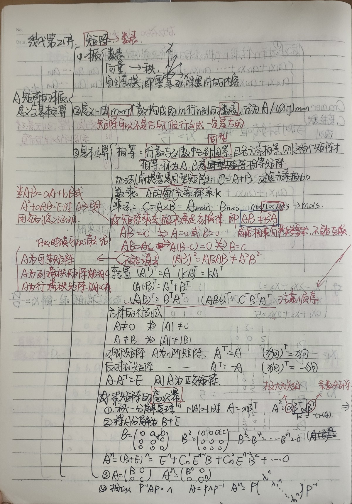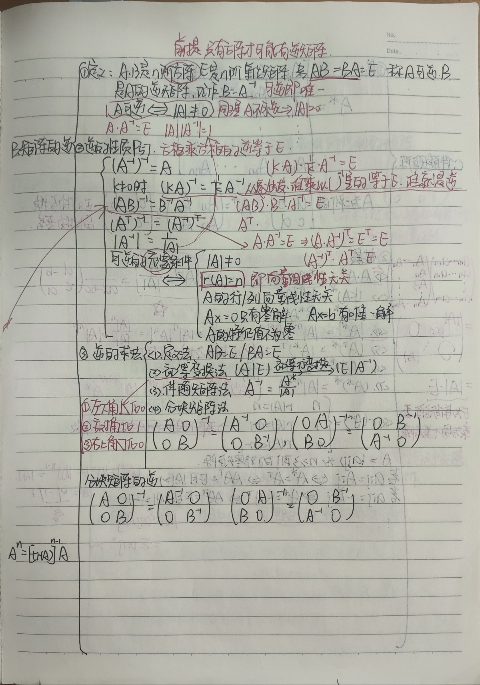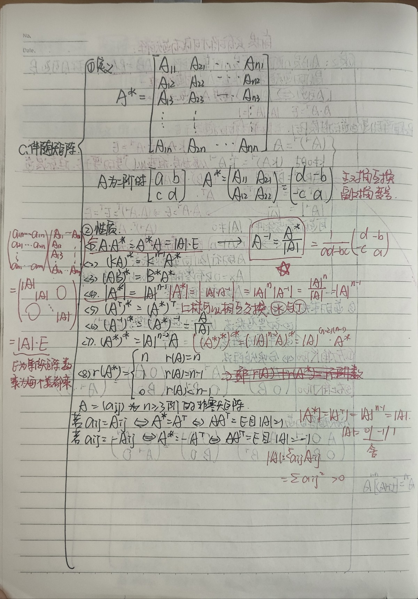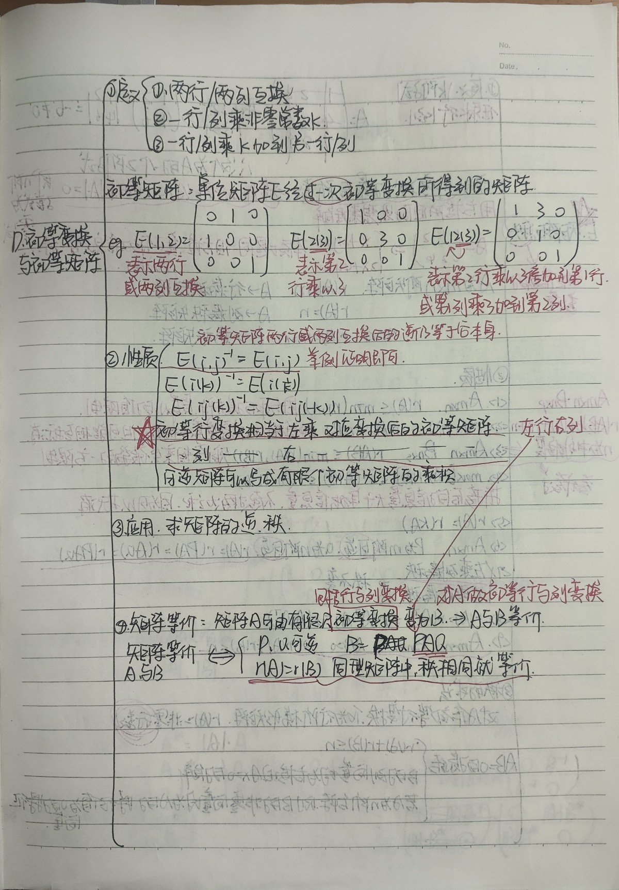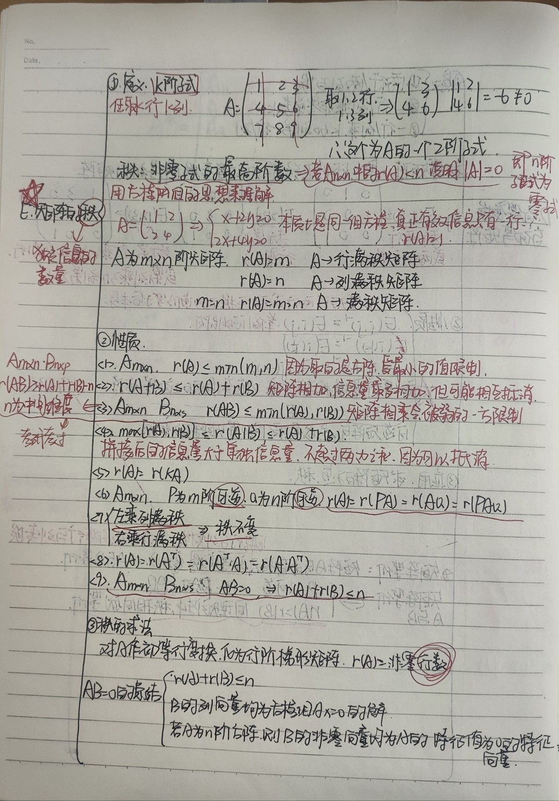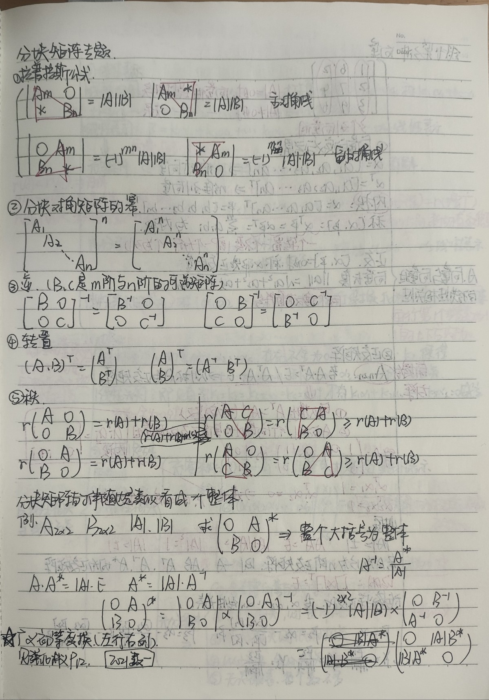

    ‍

[^4]: # 由矩阵A=A^2可以得到什么

    LAN，这个条件 **$A=A^2$** 在考研线代里真的很常见。它本质上是在说：

    ‍

    > **矩阵** **$A$** **作用一次和作用两次效果一样。**   
    > 换句话说，$A$ 是一个“投影型矩阵”，也叫 ​**幂等矩阵**。
    >

    我们可以把它当成一个超级信号：  
    只要题目给了 $A^2=A$，你脑子里就该立刻联想到下面这些结论。🔥

    ---

    # 1. 基本定义：$A$ 是幂等矩阵

    若

    $$
    A^2=A
    $$

    则称 $A$ 为 ​**幂等矩阵**。

    因为继续乘下去：

    $$
    A^3=A^2A=AA=A^2=A
    $$

    所以有：

    $$
    A^k=A,\quad k\geq 1
    $$

    也就是说：

    $$
    A,A^2,A^3,\cdots
    $$

    全都等于 $A$。

    ---

    # 2. 特征值只能是 0 或 1

    这是最重要的结论之一。

    设 $\lambda$ 是 $A$ 的特征值，存在非零向量 $x$，使得：

    $$
    Ax=\lambda x
    $$

    两边再作用一次 $A$：

    $$
    A^2x=A(\lambda x)=\lambda Ax=\lambda^2x
    $$

    但因为：

    $$
    A^2=A
    $$

    所以：

    $$
    A^2x=Ax=\lambda x
    $$

    于是：

    $$
    \lambda^2x=\lambda x
    $$

    因为 $x\neq 0$，所以：

    $$
    \lambda^2=\lambda
    $$

    即：

    $$
    \lambda(\lambda-1)=0
    $$

    所以：

    $$
    \lambda=0 \quad \text{或} \quad \lambda=1
    $$

    **结论：**

    $$
    A^2=A \Rightarrow A\text{ 的特征值只能是 }0,1
    $$

    ---

    # 3. $\det A$ 只能是 0 或 1

    因为矩阵的行列式等于所有特征值之积。

    而 $A$ 的特征值只能是 $0$ 或 $1$，所以：

    $$
    \det A=0 \quad \text{或} \quad 1
    $$

    也可以直接从行列式推：

    $$
    A^2=A
    $$

    两边取行列式：

    $$
    |A^2|=|A|
    $$

    即：

    $$
    |A|^2=|A|
    $$

    所以：

    $$
    |A|(|A|-1)=0
    $$

    因此：

    $$
    |A|=0 \quad \text{或} \quad 1
    $$

    ---

    # 4. 如果 $A$ 可逆，则 $A=E$

    这是考题特别爱考的结论。

    因为：

    $$
    A^2=A
    $$

    移项：

    $$
    A^2-A=0
    $$

    即：

    $$
    A(A-E)=0
    $$

    如果 $A$ 可逆，左乘 $A^{-1}$：

    $$
    A-E=0
    $$

    所以：

    $$
    A=E
    $$

    **结论：**

    $$
    A^2=A,\ A\text{ 可逆} \Rightarrow A=E
    $$

    换句话说，幂等矩阵如果不是单位矩阵，那它一定不可逆。

    ---

    # 5. $E-A$ 也是幂等矩阵

    这是另一个常考点。

    计算：

    $$
    (E-A)^2=E-2A+A^2
    $$

    因为 $A^2=A$，所以：

    $$
    (E-A)^2=E-2A+A=E-A
    $$

    因此：

    $$
    E-A
    $$

    也是幂等矩阵。

    **结论：**

    $$
    A^2=A \Rightarrow (E-A)^2=E-A
    $$

    这个在证明题和选择题里很常见。

    ---

    # 6. $A(E-A)=0$，$(E-A)A=0$

    因为：

    $$
    A(E-A)=A-A^2=A-A=0
    $$

    同理：

    $$
    (E-A)A=A-A^2=0
    $$

    所以：

    $$
    A(E-A)=(E-A)A=0
    $$

    这说明 $A$ 和 $E-A$ 这两个矩阵之间有一种“互相排斥”的关系。

    几何上可以理解为：

    > $A$ 投影到一个子空间，  
    > $E-A$ 投影到另一个互补子空间。
    >

    ---

    # 7. $r(A)+r(E-A)=n$

    **这个非常重要，而且很有考研味。** 

    因为 $A$ 是幂等矩阵，它的特征值只有 $0$ 和 $1$。

    如果 $A$ 是 $n$ 阶矩阵，设 $A$ 中特征值 $1$ 的个数是 $r$，特征值 $0$ 的个数是 $n-r$。

    那么：

    $$
    r(A)=r
    $$

    而 $E-A$ 的特征值是：

    $$
    1-\lambda
    $$

    所以 $E-A$ 的特征值仍然是 $0$ 或 $1$，并且原来 $A$ 的 $0$ 变成 $1$，原来 $A$ 的 $1$ 变成 $0$。

    因此：

    $$
    r(E-A)=n-r
    $$

    所以：

    $$
    r(A)+r(E-A)=n
    $$

    **结论：**

    $$
    A^2=A \Rightarrow r(A)+r(E-A)=n
    $$

    ---

    # 8. $\operatorname{tr}(A)=r(A)$

    这个也是超级常考。

    因为 $A$ 的特征值只有 $0$ 和 $1$。

    迹等于特征值之和：

    $$
    \operatorname{tr}(A)=\lambda_1+\lambda_2+\cdots+\lambda_n
    $$

    由于特征值只有 $0,1$，所以这个和就是：

    > 特征值 $1$ 的个数。
    >

    而对于幂等矩阵，秩也等于特征值 $1$ 的个数。

    因此：

    $$
    \operatorname{tr}(A)=r(A)
    $$

    **结论：**

    $$
    A^2=A \Rightarrow \operatorname{tr}(A)=r(A)
    $$

    这个结论很漂亮，选择题里经常藏着。

    ---

    # 9. $A$ 一定可以相似对角化

    因为 $A$ 的最小多项式整除：

    $$
    x^2-x=x(x-1)
    $$

    而：

    $$
    x(x-1)
    $$

    没有重根。

    所以 $A$ 一定可以相似对角化。

    也就是说，存在可逆矩阵 $P$，使得：

    $$
    P^{-1}AP=
    \begin{pmatrix}
    I_r & 0\\
    0 & 0
    \end{pmatrix}
    $$

    其中：

    $$
    r=r(A)
    $$

    这说明，从相似的角度看，幂等矩阵本质上就是：

    $$
    \begin{pmatrix}
    1 & & & \\
    & \ddots & & \\
    & & 1 & \\
    & & & 0
    \end{pmatrix}
    $$

    ---

    # 10. 几何意义：$A$ 是投影矩阵

    这个是理解它的关键。

    对于任意向量 $x$，$Ax$ 是一个新向量。

    由于：

    $$
    A^2x=Ax
    $$

    说明：

    > 一旦 $x$ 被 $A$ 作用后，已经落到了某个子空间里；  
    > 再作用一次 $A$，它不会再变了。
    >

    这就像投影：

    第一次投影：把点压到平面上；  
    第二次投影：已经在平面上了，所以不会变。

    所以 $A^2=A$ 表示：

    $$
    A\text{ 是某种投影变换}
    $$

    不过注意：

    - 若 $A=A^T$，则是 ​**正交投影矩阵**；
    - 若不满足 $A=A^T$，则是一般的投影矩阵，可能是斜投影。

    ---

    # 11. 空间分解：$\mathbb{R}^n=R(A)\oplus N(A)$

    这是偏证明题的核心。

    对任意向量 $x$，有：

    $$
    x=Ax+(x-Ax)
    $$

    也就是：

    $$
    x=Ax+(E-A)x
    $$

    其中：

    $$
    Ax\in R(A)
    $$

    而：

    $$
    A(x-Ax)=Ax-A^2x=Ax-Ax=0
    $$

    所以：

    $$
    x-Ax\in N(A)
    $$

    于是每个向量都可以拆成两部分：

    $$
    x=\text{属于 }R(A)\text{ 的部分}+\text{属于 }N(A)\text{ 的部分}
    $$

    所以：

    $$
    \mathbb{R}^n=R(A)\oplus N(A)
    $$

    也就是说：

    > 幂等矩阵把整个空间分成两个互补部分：  
    > 一个是被保留下来的方向，一个是被压成 0 的方向。
    >

    ---

    # 12. 和秩相关的常见结论

    由：

    $$
    A^2=A
    $$

    可得：

    $$
    r(A^2)=r(A)
    $$

    当然这个不稀奇，因为 $A^2=A$。

    但更重要的是：

    $$
    r(A)+r(E-A)=n
    $$

    以及：

    $$
    R(A)=N(E-A)
    $$

    为什么？

    若 $y\in R(A)$，则存在 $x$，使得：

    $$
    y=Ax
    $$

    于是：

    $$
    (E-A)y=(E-A)Ax=Ax-A^2x=0
    $$

    所以：

    $$
    y\in N(E-A)
    $$

    反过来也可以证明。

    因此：

    $$
    R(A)=N(E-A)
    $$

    同理：

    $$
    R(E-A)=N(A)
    $$

    这些在证明题里很好用。

    ---

    # 13. 与矩阵方程相关

    因为：

    $$
    A^2=A
    $$

    所以：

    $$
    A(A-E)=0
    $$

    也可以写成：

    $$
    A(E-A)=0
    $$

    所以解题时看到这种式子，要敏感：

    $$
    A^2=A
    $$

    等价于：

    $$
    A(A-E)=0
    $$

    或者：

    $$
    A(E-A)=0
    $$

    ---

    # 14. 若 $A$ 是实对称矩阵，则是正交投影

    如果题目还给：

    $$
    A^T=A
    $$

    并且：

    $$
    A^2=A
    $$

    那么 $A$ 是正交投影矩阵。

    这时还有额外结论：

    $$
    x^TAx\geq 0
    $$

    因为实对称矩阵可以正交对角化，并且特征值只有 $0,1$，所以它是半正定矩阵。

    因此：

    $$
    A^T=A,\ A^2=A \Rightarrow A\text{ 半正定}
    $$

    ---

    # 15. 常见题型总结

    以后你看到：

    $$
    A^2=A
    $$

    可以从下面几个方向想：

    |方向|结论|
    | --------| ------------------|
    |幂次|$A^k=A,\ k\geq 1$|
    |特征值|只能是$0,1$|
    |行列式|(|
    |可逆性|若$A$可逆，则$A=E$|
    |补矩阵|$E-A$也是幂等矩阵|
    |乘积|$A(E-A)=(E-A)A=0$|
    |秩|$r(A)+r(E-A)=n$|
    |迹|$\operatorname{tr}(A)=r(A)$|
    |对角化|一定可相似对角化|
    |标准形|$A\sim \operatorname{diag}(I_r,0)$|
    |空间|$\mathbb{R}^n=R(A)\oplus N(A)$|
    |几何|$A$是投影矩阵|

    ---

    # 16. 最推荐你记的版本

    考试时不需要全背，优先记这几个：

    $$
    \boxed{A^2=A}
    $$

    立即想到：

    $$
    \boxed{\lambda=0\text{ 或 }1}
    $$

    $$
    \boxed{|A|=0\text{ 或 }1}
    $$

    $$
    \boxed{A\text{ 可逆}\Rightarrow A=E}
    $$

    $$
    \boxed{E-A\text{ 也是幂等矩阵}}
    $$

    $$
    \boxed{r(A)+r(E-A)=n}
    $$

    $$
    \boxed{\operatorname{tr}(A)=r(A)}
    $$

    $$
    \boxed{A\sim 
    \begin{pmatrix}
    I_r&0\\
    0&0
    \end{pmatrix}}
    $$

    ---

    最核心的理解可以压缩成一句话：

    > **$A^2=A$** **表示** **$A$** **是投影：第一次把向量投到某个子空间，第二次就不再变化。**
    >

    你以后碰到这种题，可以先问自己一个问题：

    > 这道题是在考 ​**特征值**​、​**秩**​、​**行列式**​、​**可逆性**​，还是 ​**投影空间分解**？
    >

    这样思路就会清楚很多。

    ‍

[^5]: # 矩阵的逆：性质整理

    # 矩阵的逆：性质整理

    # 核心定义

    设 $A$ 是 $n$ 阶方阵，如果存在同阶矩阵 $B$ ，使得：

    $$
    AB=BA=E
    $$

    那么称 $A$ 可逆， $B$ 称为 $A$ 的逆矩阵，记作：

    $$
    B=A^{-1}
    $$

    因此：

    $$
    AA^{-1}=A^{-1}A=E
    $$

    这里的 $E$ 是单位矩阵，相当于普通数乘法里的 $1$ 。

    ---

    # 一、逆矩阵存在的条件

    ## 1. 只有方阵才可能有逆

    逆矩阵要求：

    $$
    AA^{-1}=A^{-1}A=E
    $$

    左右两个乘积都要有意义，并且结果都是同阶单位矩阵，所以通常意义下只有方阵才讨论逆矩阵。

    ## 2. 可逆等价于行列式不为零

    设 $A$ 是 $n$ 阶方阵，则：

    $$
    A \text{ 可逆} \Longleftrightarrow |A| \neq 0
    $$

    反过来：

    $$
    A \text{ 不可逆} \Longleftrightarrow |A|=0
    $$

    ## 3. 可逆等价于满秩

    设 $A$ 是 $n$ 阶方阵，则：

    $$
    A \text{ 可逆} \Longleftrightarrow r(A)=n
    $$

    也就是说， $A$ 可逆等价于 $A$ 满秩。

    ## 4. 可逆等价于行列向量组线性无关

    设 $A$ 是 $n$ 阶方阵，则：

    $$
    A \text{ 可逆}
    \Longleftrightarrow
    A \text{ 的行向量组线性无关}
    $$

    同时也有：

    $$
    A \text{ 可逆}
    \Longleftrightarrow
    A \text{ 的列向量组线性无关}
    $$

    直观理解：如果矩阵的列向量线性相关，说明存在重复信息，矩阵变换会压缩维度，无法完整还原，因此不可逆。

    ---

    # 二、逆矩阵的基本性质

    ## 1. 逆矩阵唯一

    如果 $A$ 可逆，那么 $A^{-1}$ 唯一。

    证明思路：

    假设 $B$ 和 $C$ 都是 $A$ 的逆矩阵，则：

    $$
    AB=BA=E
    $$

    $$
    AC=CA=E
    $$

    于是：

    $$
    B=BE
    $$

    因为：

    $$
    AC=E
    $$

    所以：

    $$
    B=B(AC)
    $$

    由结合律：

    $$
    B=(BA)C
    $$

    又因为：

    $$
    BA=E
    $$

    所以：

    $$
    B=EC=C
    $$

    因此逆矩阵唯一。

    ## 2. 逆的逆等于原矩阵

    如果 $A$ 可逆，则：

    $$
    (A^{-1})^{-1}=A
    $$

    因为 $A$ 与 $A^{-1}$ 互为逆矩阵。

    ## 3. 单位矩阵的逆还是单位矩阵

    $$
    E^{-1}=E
    $$

    因为：

    $$
    EE=E
    $$

    ## 4. 零矩阵不可逆

    零矩阵 $O$ 不可逆，因为：

    $$
    |O|=0
    $$

    直观理解：零矩阵会把所有向量都变成零向量，信息完全丢失，无法还原。

    ---

    # 三、乘法相关性质

    ## 1. 两个可逆矩阵的乘积仍然可逆

    如果 $A$ 和 $B$ 都可逆，那么 $AB$ 也可逆。

    ## 2. 乘积的逆要倒序

    最重要公式：

    $$
    (AB)^{-1}=B^{-1}A^{-1}
    $$

    注意：顺序一定要反过来。

    验证：

    $$
    (AB)(B^{-1}A^{-1})
    =
    A(BB^{-1})A^{-1}
    $$

    因为：

    $$
    BB^{-1}=E
    $$

    所以：

    $$
    A(BB^{-1})A^{-1}=AEA^{-1}
    $$

    于是：

    $$
    AEA^{-1}=AA^{-1}=E
    $$

    因此：

    $$
    (AB)^{-1}=B^{-1}A^{-1}
    $$

    直观理解：先做 $A$ 再做 $B$ ，还原时要先撤销 $B$ ，再撤销 $A$ 。所以顺序反过来。

    ## 3. 多个矩阵乘积的逆也要倒序

    如果 $A,B,C$ 都可逆，则：

    $$
    (ABC)^{-1}=C^{-1}B^{-1}A^{-1}
    $$

    一般地：

    $$
    (A_1A_2\cdots A_m)^{-1}
    =
    A_m^{-1}\cdots A_2^{-1}A_1^{-1}
    $$

    ## 4. 不能随便交换矩阵顺序

    一般情况下：

    $$
    AB \neq BA
    $$

    所以不能把：

    $$
    (AB)^{-1}
    $$

    写成：

    $$
    A^{-1}B^{-1}
    $$

    除非 $A$ 和 $B$ 可交换，即：

    $$
    AB=BA
    $$

    ---

    # 四、数乘相关性质

    ## 1. 数乘矩阵的逆

    如果 $A$ 可逆，且 $k \neq 0$ ，则：

    $$
    (kA)^{-1}=\frac{1}{k}A^{-1}
    $$

    验证：

    $$
    (kA)\left(\frac{1}{k}A^{-1}\right)
    =
    AA^{-1}
    $$

    所以：

    $$
    (kA)\left(\frac{1}{k}A^{-1}\right)=E
    $$

    因此：

    $$
    (kA)^{-1}=\frac{1}{k}A^{-1}
    $$

    ## 2. 注意 $k=0$ 时不成立

    如果 $k=0$ ，则：

    $$
    kA=O
    $$

    零矩阵不可逆，所以不能写：

    $$
    (0A)^{-1}
    $$

    ---

    # 五、转置相关性质

    ## 转置矩阵的逆

    如果 $A$ 可逆，则 $A^T$ 也可逆，并且：

    $$
    (A^T)^{-1}=(A^{-1})^T
    $$

    证明：

    因为：

    $$
    AA^{-1}=E
    $$

    两边取转置：

    $$
    (AA^{-1})^T=E^T
    $$

    利用转置性质：

    $$
    (AA^{-1})^T=(A^{-1})^TA^T
    $$

    又因为：

    $$
    E^T=E
    $$

    所以：

    $$
    (A^{-1})^TA^T=E
    $$

    同理也可以得到：

    $$
    A^T(A^{-1})^T=E
    $$

    因此：

    $$
    (A^T)^{-1}=(A^{-1})^T
    $$

    ---

    # 六、行列式相关性质

    ## 1. 逆矩阵的行列式

    如果 $A$ 可逆，则：

    $$
    |A^{-1}|=\frac{1}{|A|}
    $$

    推导：

    因为：

    $$
    AA^{-1}=E
    $$

    两边取行列式：

    $$
    |AA^{-1}|=|E|
    $$

    由行列式乘法性质：

    $$
    |A|\cdot |A^{-1}|=1
    $$

    所以：

    $$
    |A^{-1}|=\frac{1}{|A|}
    $$

    ## 2. 可逆矩阵行列式一定非零

    如果 $A$ 可逆，则：

    $$
    |A| \neq 0
    $$

    反过来也成立：

    $$
    |A| \neq 0 \Longrightarrow A \text{ 可逆}
    $$

    ---

    # 七、幂相关性质

    ## 1. 矩阵幂的逆

    如果 $A$ 可逆，则：

    $$
    (A^m)^{-1}=(A^{-1})^m
    $$

    其中 $m$ 是正整数。

    例如：

    $$
    (A^3)^{-1}=(A^{-1})^3
    $$

    也就是：

    $$
    (A^3)^{-1}=A^{-1}A^{-1}A^{-1}
    $$

    ## 2. 负整数次幂

    如果 $A$ 可逆，可以定义：

    $$
    A^{-m}=(A^{-1})^m
    $$

    例如：

    $$
    A^{-2}=(A^{-1})^2
    $$

    ---

    # 八、伴随矩阵相关性质

    ## 1. 逆矩阵可以用伴随矩阵表示

    如果 $A$ 可逆，则：

    $$
    A^{-1}=\frac{1}{|A|}A^*
    $$

    其中 $A^*$ 是 $A$ 的伴随矩阵。

    ## 2. 伴随矩阵与原矩阵的关系

    对任意 $n$ 阶矩阵 $A$ ，都有：

    $$
    AA^*=A^*A=|A|E
    $$

    如果：

    $$
    |A| \neq 0
    $$

    则两边除以 $|A|$ ，得到：

    $$
    A\left(\frac{1}{|A|}A^*\right)=E
    $$

    所以：

    $$
    A^{-1}=\frac{1}{|A|}A^*
    $$

    ---

    # 九、初等矩阵相关性质

    ## 1. 初等矩阵都可逆

    初等矩阵是由单位矩阵经过一次初等变换得到的矩阵。

    所有初等矩阵都可逆，因为每一种初等变换都可以反向操作。

    |初等变换|逆操作|
    | ------------------| ------------------|
    |交换两行|再交换一次|
    |某行乘非零数 $k$|该行乘 $\frac{1}{k}$|
    |某行加另一行的 $k$ 倍|再减去另一行的 $k$ 倍|

    ## 2. 可逆矩阵可以表示为初等矩阵的乘积

    如果 $A$ 可逆，那么 $A$ 可以通过初等行变换化为单位矩阵。

    因此存在若干初等矩阵 $P_1,P_2,\cdots,P_s$ ，使得：

    $$
    P_s\cdots P_2P_1A=E
    $$

    所以 $A$ 可以表示为若干初等矩阵的乘积。

    ---

    # 十、线性方程组相关性质

    ## 1. 可逆等价于非齐次方程组有唯一解

    设 $A$ 是 $n$ 阶方阵，则：

    $$
    A \text{ 可逆}
    \Longleftrightarrow
    AX=b \text{ 对任意 } b \text{ 都有唯一解}
    $$

    如果 $A$ 可逆，那么：

    $$
    AX=b
    $$

    左乘 $A^{-1}$ ：

    $$
    A^{-1}AX=A^{-1}b
    $$

    于是：

    $$
    X=A^{-1}b
    $$

    ## 2. 可逆等价于齐次方程组只有零解

    设 $A$ 是 $n$ 阶方阵，则：

    $$
    A \text{ 可逆}
    \Longleftrightarrow
    AX=0 \text{ 只有零解}
    $$

    ---

    # 十一、秩相关性质

    ## 1. 可逆矩阵左乘或右乘不改变秩

    如果 $P$ 和 $Q$ 都可逆，则：

    $$
    r(PAQ)=r(A)
    $$

    特别地：

    $$
    r(PA)=r(A)
    $$

    $$
    r(AQ)=r(A)
    $$

    直观理解：可逆矩阵代表一种可以还原的变换，所以不会改变矩阵中独立信息的数量。

    ## 2. 可逆矩阵本身满秩

    如果 $A$ 是 $n$ 阶可逆矩阵，则：

    $$
    r(A)=n
    $$

    ---

    # 十二、特殊矩阵的逆

    ## 1. 对角矩阵的逆

    如果：

    $$
    D=
    \begin{pmatrix}
    d_1 & 0 & \cdots & 0 \\
    0 & d_2 & \cdots & 0 \\
    \vdots & \vdots & \ddots & \vdots \\
    0 & 0 & \cdots & d_n
    \end{pmatrix}
    $$

    且：

    $$
    d_1d_2\cdots d_n \neq 0
    $$

    那么：

    $$
    D^{-1}=
    \begin{pmatrix}
    \frac{1}{d_1} & 0 & \cdots & 0 \\
    0 & \frac{1}{d_2} & \cdots & 0 \\
    \vdots & \vdots & \ddots & \vdots \\
    0 & 0 & \cdots & \frac{1}{d_n}
    \end{pmatrix}
    $$

    也就是：对角矩阵求逆，只需要把每个对角元取倒数。

    ## 2. 正交矩阵的逆

    如果 $A$ 是正交矩阵，则：

    $$
    A^TA=E
    $$

    所以：

    $$
    A^{-1}=A^T
    $$

    一句话：正交矩阵的逆等于它的转置。

    ## 3. 三角矩阵的逆

    如果 $A$ 是上三角矩阵或下三角矩阵，则 $A$ 可逆的条件是主对角线元素全不为零。

    也就是：

    $$
    a_{11}a_{22}\cdots a_{nn} \neq 0
    $$

    因为三角矩阵的行列式等于主对角线元素之积：

    $$
    |A|=a_{11}a_{22}\cdots a_{nn}
    $$

    所以只要主对角线元素都不为零，矩阵就可逆。

    ---

    # 十三、常用等价命题总结

    设 $A$ 是 $n$ 阶方阵，则下面命题等价：

    $$
    A \text{ 可逆}
    $$

    等价于：

    $$
    |A| \neq 0
    $$

    等价于：

    $$
    r(A)=n
    $$

    等价于：

    $$
    A \text{ 的行向量组线性无关}
    $$

    等价于：

    $$
    A \text{ 的列向量组线性无关}
    $$

    等价于：

    $$
    AX=0 \text{ 只有零解}
    $$

    等价于：

    $$
    AX=b \text{ 对任意 } b \text{ 都有唯一解}
    $$

    等价于：

    $$
    A \text{ 可以经过初等行变换化为 } E
    $$

    等价于：

    $$
    A \text{ 可以表示为若干初等矩阵的乘积}
    $$

    ---

    # 十四、最常考公式汇总

    ## 1. 定义

    $$
    AA^{-1}=A^{-1}A=E
    $$

    ## 2. 逆的逆

    $$
    (A^{-1})^{-1}=A
    $$

    ## 3. 乘积的逆

    $$
    (AB)^{-1}=B^{-1}A^{-1}
    $$

    ## 4. 多个矩阵乘积的逆

    $$
    (ABC)^{-1}=C^{-1}B^{-1}A^{-1}
    $$

    ## 5. 数乘的逆

    $$
    (kA)^{-1}=\frac{1}{k}A^{-1}
    $$

    其中：

    $$
    k \neq 0
    $$

    ## 6. 转置的逆

    $$
    (A^T)^{-1}=(A^{-1})^T
    $$

    ## 7. 幂的逆

    $$
    (A^m)^{-1}=(A^{-1})^m
    $$

    ## 8. 逆矩阵的行列式

    $$
    |A^{-1}|=\frac{1}{|A|}
    $$

    ## 9. 伴随矩阵公式

    $$
    A^{-1}=\frac{1}{|A|}A^*
    $$

    ---

    # 十五、易错点

    ## 1. 只有方阵才有通常意义下的逆

    不要看到矩阵就默认可以求逆，必须先看它是不是方阵。

    ## 2. 乘积的逆顺序一定要反

    错误写法：

    $$
    (AB)^{-1}=A^{-1}B^{-1}
    $$

    正确写法：

    $$
    (AB)^{-1}=B^{-1}A^{-1}
    $$

    ## 3. 数乘公式要求 $k \neq 0$

    正确公式：

    $$
    (kA)^{-1}=\frac{1}{k}A^{-1}
    $$

    前提是：

    $$
    k \neq 0
    $$

    如果 $k=0$ ，那么 $kA=O$ ，零矩阵不可逆。

    ## 4. $A^{-1}$ 不是把每个元素都取倒数

    例如：

    $$
    A=
    \begin{pmatrix}
    1 & 2 \\
    3 & 4
    \end{pmatrix}
    $$

    它的逆矩阵不是：

    $$
    \begin{pmatrix}
    1 & \frac{1}{2} \\
    \frac{1}{3} & \frac{1}{4}
    \end{pmatrix}
    $$

    矩阵求逆不是逐元素取倒数。

    只有对角矩阵在对角元都非零时，才可以把每个对角元分别取倒数。

    ---

    # 一句话总结

    矩阵的逆就是矩阵里的“倒数”，核心定义是：

    $$
    AA^{-1}=A^{-1}A=E
    $$

    判断矩阵能不能求逆，主要看：

    $$
    |A| \neq 0
    $$

    或者：

    $$
    r(A)=n
    $$

    最容易考错的是：

    $$
    (AB)^{-1}=B^{-1}A^{-1}
    $$

    也就是乘积求逆时顺序必须反过来。

[^6]: # 第三章 向量

    证明线性无关常见的方法总结[^7]

    向量空间与基[^8]

    旧向量的线性组合构成新向量组题型[^9]

    # 笔记总结

    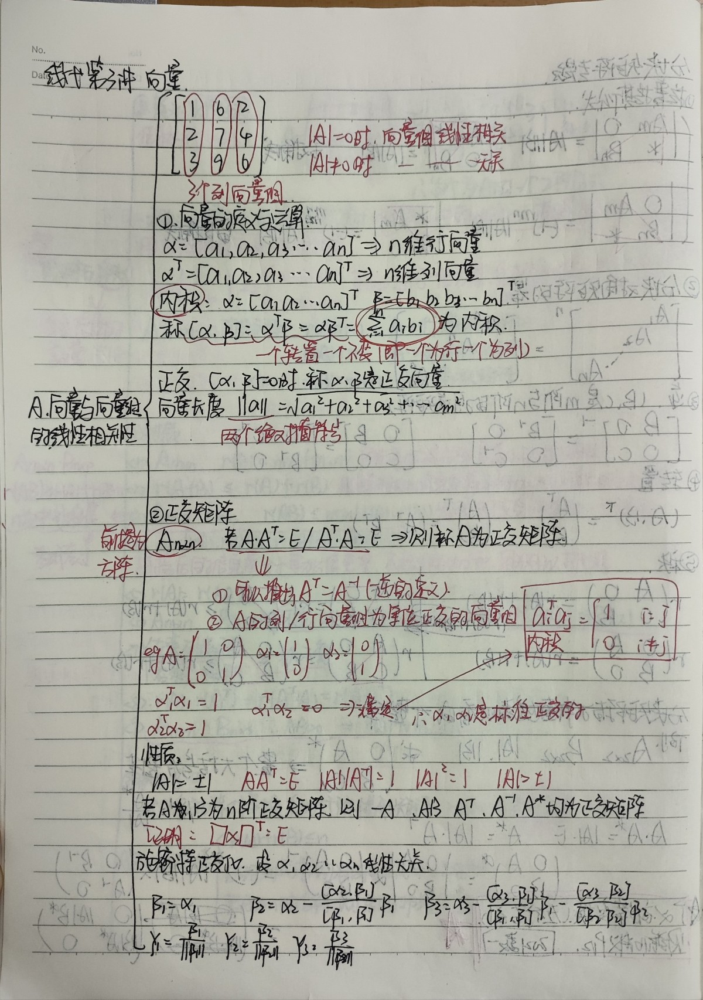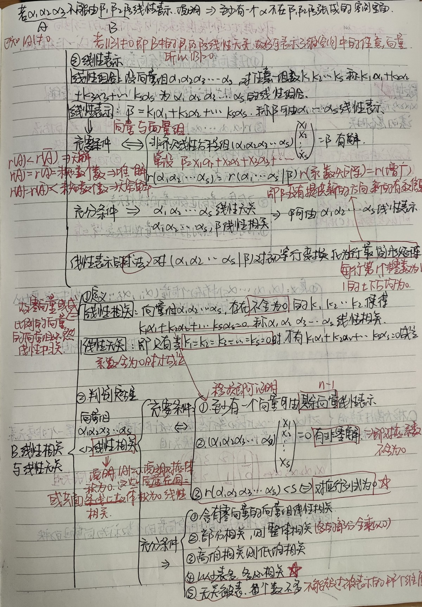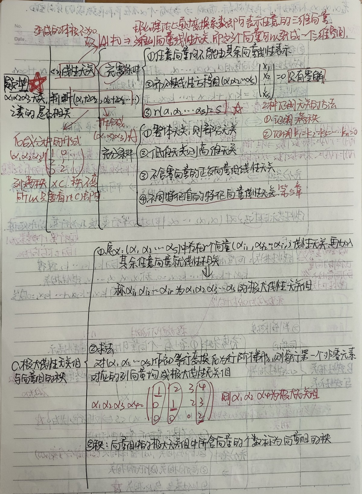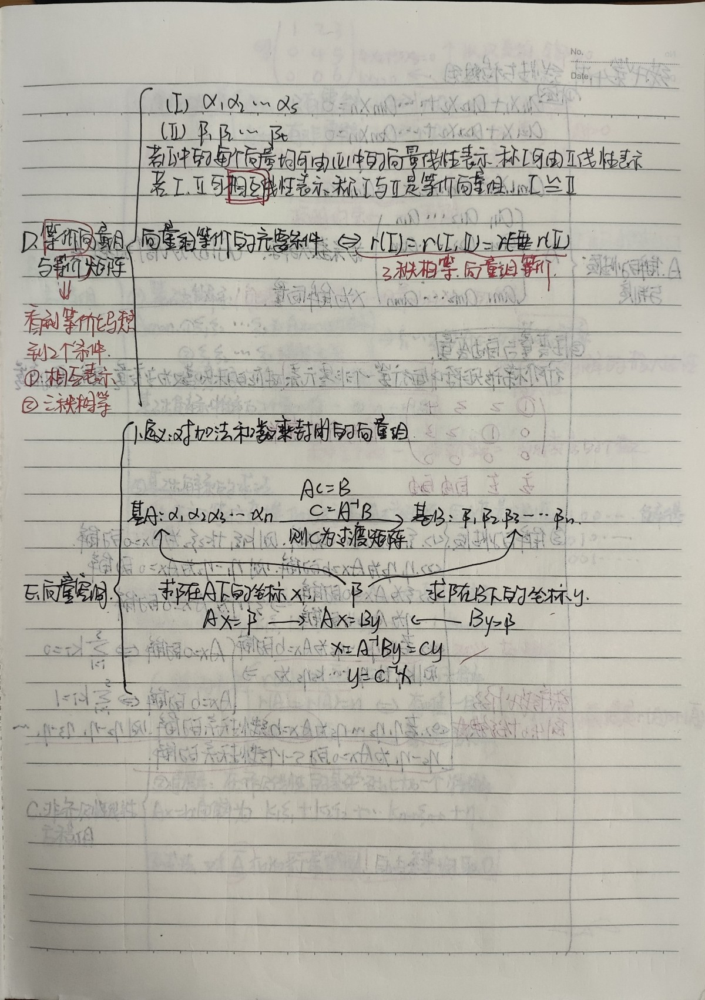

    ‍

[^7]: # 证明线性无关常见的方法总结

    证明**线性无关**在考研线代里非常高频，本质就一句话：

    $$
    \boxed{\text{证明 }k_1\alpha_1+\cdots+k_s\alpha_s=0\text{ 只能推出 }k_1=\cdots=k_s=0}
    $$

    但不同题型有不同“入口”。我给你按考研常见套路归纳一下。

    ---

    # 一、定义法：最基础，也最万能

    要证：

    $$
    \alpha_1,\alpha_2,\cdots,\alpha_s
    $$

    线性无关，就设：

    $$
    k_1\alpha_1+k_2\alpha_2+\cdots+k_s\alpha_s=0
    $$

    然后证明：

    $$
    k_1=k_2=\cdots=k_s=0
    $$

    这就是最标准方法。

    比如刚才“两两正交”的题，就是定义法：

    $$
    k_1\alpha_1+k_2\alpha_2+k_3\alpha_3=0
    $$

    两边乘 $\alpha_1^T$，得：

    $$
    k_1\alpha_1^T\alpha_1=0
    $$

    因为 $\alpha_1\neq 0$，所以：

    $$
    k_1=0
    $$

    同理：

    $$
    k_2=k_3=0
    $$

    因此线性无关。

    ---

    # 二、行列式法：方阵列向量最常用

    如果有 $n$ 个 $n$ 维向量：

    $$
    \alpha_1,\alpha_2,\cdots,\alpha_n
    $$

    把它们拼成矩阵：

    $$
    A=(\alpha_1,\alpha_2,\cdots,\alpha_n)
    $$

    如果：

    $$
    |A|\neq 0
    $$

    那么：

    $$
    \boxed{\alpha_1,\alpha_2,\cdots,\alpha_n\text{ 线性无关}}
    $$

    如果：

    $$
    |A|=0
    $$

    那么它们线性相关。

    这个方法特别适合三维三个向量、二维两个向量。

    ---

    # 三、秩法：向量个数等于秩

    设向量组：

    $$
    \alpha_1,\alpha_2,\cdots,\alpha_s
    $$

    组成矩阵：

    $$
    A=(\alpha_1,\alpha_2,\cdots,\alpha_s)
    $$

    如果：

    $$
    r(A)=s
    $$

    也就是矩阵的秩等于向量个数，那么：

    $$
    \boxed{\alpha_1,\alpha_2,\cdots,\alpha_s\text{ 线性无关}}
    $$

    如果：

    $$
    r(A)<s
    $$

    则线性相关。

    这个方法比行列式法更一般，因为向量个数不一定等于维数。

    比如 $3$ 个 $4$ 维向量，没法直接算行列式，但可以看秩。

    ---

    # 四、齐次方程法：看 $Ax=0$ 是否只有零解

    把向量组作为列向量组成矩阵：

    $$
    A=(\alpha_1,\alpha_2,\cdots,\alpha_s)
    $$

    线性组合为零：

    $$
    x_1\alpha_1+x_2\alpha_2+\cdots+x_s\alpha_s=0
    $$

    等价于：

    $$
    Ax=0
    $$

    如果齐次方程：

    $$
    Ax=0
    $$

    只有零解，则列向量组线性无关。

    如果有非零解，则线性相关。

    所以：

    $$
    \boxed{Ax=0\text{ 只有零解}\iff \alpha_1,\cdots,\alpha_s\text{ 线性无关}}
    $$

    这其实是定义法的矩阵版本。

    ---

    # 五、反证法：证明题最常见

    有些题直接证明很绕，可以反证。

    比如要证：

    $$
    \alpha,A\alpha,\cdots,A^{m-1}\alpha
    $$

    线性无关。

    设它们线性相关：

    $$
    k_0\alpha+k_1A\alpha+\cdots+k_{m-1}A^{m-1}\alpha=0
    $$

    然后通过题目条件推出：

    $$
    k_0=k_1=\cdots=k_{m-1}=0
    $$

    发现和“线性相关”矛盾，于是线性无关。

    严格说这还是定义法，但证明形式是反证法。

    ---

    # 六、乘矩阵筛系数法：遇到 $A^m\alpha=0$ 特别好用

    这是你刚刚那类题：

    已知：

    $$
    A^{m-1}\alpha\neq 0,\quad A^m\alpha=0
    $$

    证明：

    $$
    \alpha,A\alpha,\cdots,A^{m-1}\alpha
    $$

    线性无关。

    设：

    $$
    k_0\alpha+k_1A\alpha+\cdots+k_{m-1}A^{m-1}\alpha=0
    $$

    两边乘：

    $$
    A^{m-1}
    $$

    只剩：

    $$
    k_0A^{m-1}\alpha=0
    $$

    所以：

    $$
    k_0=0
    $$

    再乘：

    $$
    A^{m-2}
    $$

    推出：

    $$
    k_1=0
    $$

    依次推出全部系数为 0。

    这类题的关键词是：

    $$
    A^m\alpha=0,\quad A^{m-1}\alpha\neq 0
    $$

    看到这种，就想到“​**乘** **$A^{m-1},A^{m-2},\cdots$** **筛系数**”。

    ---

    # 七、正交法：非零且两两正交必线性无关

    如果：

    $$
    \alpha_i^T\alpha_j=0\quad(i\neq j)
    $$

    并且：

    $$
    \alpha_i\neq 0
    $$

    那么：

    $$
    \boxed{\alpha_1,\alpha_2,\cdots,\alpha_s\text{ 线性无关}}
    $$

    证明方法就是刚才那个：

    设：

    $$
    k_1\alpha_1+\cdots+k_s\alpha_s=0
    $$

    两边乘 $\alpha_i^T$，只剩：

    $$
    k_i\alpha_i^T\alpha_i=0
    $$

    因为：

    $$
    \alpha_i^T\alpha_i\neq 0
    $$

    所以：

    $$
    k_i=0
    $$

    ---

    # 八、维数法：“个数超过维数必相关”

    这是判断题常用。

    在 $n$ 维空间里，最多只能有 $n$ 个线性无关向量。

    所以如果有 $s$ 个 $n$ 维向量，且：

    $$
    s>n
    $$

    那么它们一定线性相关。

    反过来，若：

    $$
    s\leq n
    $$

    不能直接说它们线性无关，还要继续判断。

    比如：

    $$
    (1,0),(2,0)
    $$

    两个二维向量，个数没有超过维数，但它们还是相关。

    所以：

    $$
    \boxed{\text{个数超过维数} \Rightarrow \text{一定相关}}
    $$

    但：

    $$
    \boxed{\text{个数不超过维数} \nRightarrow \text{一定无关}}
    $$

    ---

    # 九、线性表示法：“不能被前面的表示”

    如果一个向量组满足：

    $$
    \alpha_1\neq 0
    $$

    $$
    \alpha_2\text{ 不能由 }\alpha_1\text{ 表示}
    $$

    $$
    \alpha_3\text{ 不能由 }\alpha_1,\alpha_2\text{ 表示}
    $$

    $$
    \cdots
    $$

    那么这个向量组线性无关。

    也就是说：

    > 每加入一个新向量，都带来一个新方向。
    >

    这就是从“空间维数逐步增加”的角度看线性无关。

    ---

    # 十、初等变换法：化成阶梯形看非零列/主元

    把向量组作为列组成矩阵：

    $$
    A=(\alpha_1,\alpha_2,\cdots,\alpha_s)
    $$

    做初等行变换化阶梯形。

    如果每一列都有主元，即：

    $$
    r(A)=s
    $$

    则列向量组线性无关。

    如果有自由变量，即：

    $$
    r(A)<s
    $$

    则线性相关。

    这个方法适合具体计算题。

    ---

    # 十一、特征值法：不同特征值对应的特征向量线性无关

    考研也常考这个结论：

    若：

    $$
    A\alpha_i=\lambda_i\alpha_i
    $$

    且：

    $$
    \lambda_1,\lambda_2,\cdots,\lambda_s
    $$

    互不相同，那么对应的非零特征向量：

    $$
    \alpha_1,\alpha_2,\cdots,\alpha_s
    $$

    线性无关。

    也就是：

    $$
    \boxed{\text{不同特征值对应的特征向量线性无关}}
    $$

    这个在特征值、相似对角化那里特别常用。

    ---

    # 十二、最高次项/最低次项法：函数、数列向量常用

    有时向量不是普通数字向量，而是函数，比如：

    $$
    1,x,x^2,\cdots,x^n
    $$

    要证明它们线性无关，设：

    $$
    k_0+k_1x+\cdots+k_nx^n=0
    $$

    恒等为零。

    则多项式所有系数都为零：

    $$
    k_0=k_1=\cdots=k_n=0
    $$

    所以线性无关。

    类似地，指数函数：

    $$
    e^x,e^{2x},e^{3x}
    $$

    也常用类似思路。

    ---

    # 最常用的考研套路总结

    你可以按题目特征选方法：

    |题目特征|优先方法|
    | --------------------| ----------------------------|
    |给具体坐标向量|行列式法 / 秩法|
    |有$n$个$n$维向量|算行列式|
    |向量个数不等于维数|看秩|
    |让你“证明无关”|定义法|
    |有正交条件|两边乘$\alpha_i^T$|
    |有$A^m\alpha=0$|乘$A^{m-1},A^{m-2}$筛系数|
    |有线性表示关系|用“无关被表，个数不多”|
    |有特征值|不同特征值对应特征向量无关|
    |判断题|维数法、反例法|

    ---

    ## 你真正要记住的第一性原理

    所有证明线性无关，本质都是在证明：

    $$
    \boxed{k_1\alpha_1+\cdots+k_s\alpha_s=0\Rightarrow k_1=\cdots=k_s=0}
    $$

    其他方法只是不同题型下更快地证明这件事。

    所以考场上你可以先问自己一句：

    > 这道题有没有特殊结构，能帮我把系数一个个“逼成 0”？
    >

    比如：

    - 正交：用内积逼系数；
    - $A^m\alpha=0$：用乘 $A^k$ 逼系数；
    - 行列式非零：用矩阵可逆逼系数；
    - 特征值不同：用特征值差异逼系数。

    抓住这个，你就不会乱了。

    ‍

[^8]: # 向量空间与基

    

                            
                            <main class="kg-card-main">
                                

                                    

                                        <a class="kg-bookmark-container" href="https://www.bilibili.com/video/BV1DJ4m1w7pr/?spm_id_from=333.337.search-card.all.click&vd_source=42bec97100a0d831cda9a1c7895b2cb1">
                                            

                                                
考研必看！彻底搞懂向量空间 （仅数一）_哔哩哔哩_bilibili

                                                
本视频来自李老师考研数学全程班，开课地址公众号：云上硕，回复关键字“讲义”即可获取听课讲义！！！参与课程限时送历年真题逐题讲解！！！课程直达链接：https://shop99752578.m.youzan.com/v2/feature/wYassP8kcT, 视频播放量 46422、弹幕量 145、点赞数 887、投硬币枚数 450、收藏人数 992、转发人数 135, 视频作者 考研数学李烈老师, 作者简介 李老师2027考研数学全程班开课啦！公众号“云上硕”里面报名！，相关视频：线性代数 -向量空间，【熟肉】线性代数的本质 - 01 - 向量究竟是什么？，CXY-004素人教師の线性代数大观（下篇)，23.《线性代数》向量空间的基、维数、坐标及坐标变换，这个视频，彻底搞定“向量组的相关性证明”！（考研必看），《线性代数》精讲课程 | 框框老师，一个小时速通线性代数全概念，【李永乐】27考研数学线性代数基础课 | 《线代基础篇》配套视频，《线性代数》4小时速成课（不挂科） | 框框老师，《线性代数》习题课，零废话，超精讲！【孔祥仁】

                                                

                                                    
                                                    考研数学李烈老师
                                                    https://www.bilibili.com
                                                

                                            

                                            

                                                    
                                                

                                        </a>
                                    

                                

                            </main>
                        

    > **向量空间跟基这部分是数一专门要学的，这部分历年考察得多吗？给我解释一下这块的知识，我还没学过这一块**
    >

    你这个问题问得很对：​ **“向量空间、基、坐标、过渡矩阵”这块确实更偏数一特色**，数二/数三一般不把它作为独立重点来考。考纲里数学一向量部分明确包含“$n$ 维向量空间、子空间、基底、维数、坐标、基变换和坐标变换公式、过渡矩阵”等内容；线代在数学一试卷结构中大约占 20%。

    至于​**历年考察多不多**​：  
    它不像“线性相关/无关、秩、方程组、特征值、二次型”那样几乎年年作为主线高频出现，但它常常和“向量组、线性表示、矩阵秩、坐标变换”混在一起考。也就是说：\*\*单独考“向量空间定义”的概率不大，但考“两个基之间的坐标转换、过渡矩阵”是数一需要会的。\*\*一些真题总结也会把向量组的线性相关性视为向量部分的重中之重，而基与坐标变换就是建立在这部分之上的延伸。

    ---

    # 1. 你先把“向量空间”理解成什么？

    先别被名字吓到。

    你可以把**向量空间**理解成：

    $$
    \boxed{\text{一堆向量组成的集合，并且加法、数乘之后还在这个集合里}}
    $$

    比如：

    $$
    \mathbb R^3
    $$

    就是所有三维列向量组成的空间：

    $$
    (x,y,z)^T
    $$

    里面任意两个向量相加，还是三维向量；任意一个向量乘一个数，还是三维向量。

    所以：

    $$
    \mathbb R^3
    $$

    是一个向量空间。

    ---

    # 2. 什么是“基”？

    这是核心。

    在三维空间里，最熟悉的一组基是：

    $$
    e_1=(1,0,0)^T,\quad e_2=(0,1,0)^T,\quad e_3=(0,0,1)^T
    $$

    为什么它们叫一组基？

    因为它们满足两个条件：

    ## 条件一：线性无关

    $$
    e_1,e_2,e_3
    $$

    互相不能由别人表示。

    也就是三个方向互相独立。

    ## 条件二：能表示整个空间

    任意三维向量：

    $$
    (x,y,z)^T
    $$

    都可以写成：

    $$
    x e_1+y e_2+z e_3
    $$

    所以：

    $$
    e_1,e_2,e_3
    $$

    能撑起整个 $\mathbb R^3$。

    因此它们是 $\mathbb R^3$ 的一组基。

    ---

    # 3. 一句话理解“基”

    $$
    \boxed{\text{基}=\text{一组刚好够用的独立方向}}
    $$

    “刚好够用”是什么意思？

    - 少一个，不够表示整个空间；
    - 多一个，就会相关；
    - 不多不少，刚好撑起整个空间。

    在 $\mathbb R^3$ 里，一组基一定有 3 个线性无关向量。

    ---

    # 4. 什么是“维数”？

    维数就是一组基里面向量的个数。

    比如：

    $$
    \mathbb R^3
    $$

    的一组基有 3 个向量，所以：

    $$
    \dim \mathbb R^3=3
    $$

    你可以理解成：

    $$
    \boxed{\text{维数}=\text{这个空间需要几个独立方向才能撑起来}}
    $$

    ---

    # 5. 什么是“坐标”？

    这是最容易混的地方。

    同一个向量，在不同的基下，坐标可能不同。

    比如在标准基：

    $$
    e_1=(1,0,0)^T,\quad e_2=(0,1,0)^T,\quad e_3=(0,0,1)^T
    $$

    下，

    $$
    v=(2,3,4)^T
    $$

    意思就是：

    $$
    v=2e_1+3e_2+4e_3
    $$

    所以 $v$ 在标准基下的坐标是：

    $$
    \begin{pmatrix}
    2\\3\\4
    \end{pmatrix}
    $$

    但是如果换一组基：

    $$
    \alpha_1,\alpha_2,\alpha_3
    $$

    那么 $v$ 可能写成：

    $$
    v=x_1\alpha_1+x_2\alpha_2+x_3\alpha_3
    $$

    这时候：

    $$
    \begin{pmatrix}
    x_1\\x_2\\x_3
    \end{pmatrix}
    $$

    才是 $v$ 在基 $\alpha_1,\alpha_2,\alpha_3$ 下的坐标。

    ---

    # 6. 最重要的公式

    设：

    $$
    A=(\alpha_1,\alpha_2,\alpha_3)
    $$

    如果 $x$ 是向量 $v$ 在基 $\alpha$ 下的坐标，那么：

    $$
    v=A x
    $$

    也就是：

    $$
    \boxed{\text{原向量}=\text{基矩阵}\times \text{该基下的坐标}}
    $$

    这个公式巨重要。

    写成：

    $$
    v=(\alpha_1,\alpha_2,\alpha_3)
    \begin{pmatrix}
    x_1\\x_2\\x_3
    \end{pmatrix}
    $$

    就是：

    $$
    v=x_1\alpha_1+x_2\alpha_2+x_3\alpha_3
    $$

    ---

    # 7. 什么是“过渡矩阵”？

    假设有两组基：

    $$
    \alpha_1,\alpha_2,\alpha_3
    $$

    和

    $$
    \beta_1,\beta_2,\beta_3
    $$

    令：

    $$
    A=(\alpha_1,\alpha_2,\alpha_3)
    $$

    $$
    B=(\beta_1,\beta_2,\beta_3)
    $$

    如果同一个向量 $v$，在 $\alpha$ 基下坐标是 $x$，在 $\beta$ 基下坐标是 $y$，那么：

    $$
    v=Ax
    $$

    也有：

    $$
    v=By
    $$

    所以：

    $$
    Ax=By
    $$

    于是：

    $$
    y=B^{-1}Ax
    $$

    这里：

    $$
    \boxed{B^{-1}A}
    $$

    就是​**由基** **$\alpha$** **到基** **$\beta$** **的坐标过渡矩阵**。

    也就是：

    $$
    \boxed{
    [v]_{\beta}=B^{-1}A[v]_{\alpha}
    }
    $$

    ---

    # 8. 这类题怎么做？

    你图里这道题就是典型的“两个基之间的过渡矩阵”。

    题目给了两组基：

    $$
    \alpha_1,\alpha_2,\alpha_3
    $$

    和

    $$
    \beta_1,\beta_2,\beta_3
    $$

    第 1 问：  
    **求由基** **$\alpha$** **到基** **$\beta$** **的过渡矩阵。**

    套路是：

    $$
    \boxed{P_{\alpha\to\beta}=B^{-1}A}
    $$

    其中：

    $$
    A=(\alpha_1,\alpha_2,\alpha_3)
    $$

    $$
    B=(\beta_1,\beta_2,\beta_3)
    $$

    第 2 问：  
    **求向量** **$\gamma$** **在这两个基下的坐标。**

    套路是：

    如果求 $\gamma$ 在 $\alpha$ 基下坐标：

    $$
    \boxed{[\gamma]_{\alpha}=A^{-1}\gamma}
    $$

    如果求 $\gamma$ 在 $\beta$ 基下坐标：

    $$
    \boxed{[\gamma]_{\beta}=B^{-1}\gamma}
    $$

    第 3 问：  
    **求一个向量** **$\delta$**​ **，使它在这两个基下有相同坐标。**

    这个意思是：

    $$
    [\delta]_{\alpha}=[\delta]_{\beta}
    $$

    设这个共同坐标为 $x$，则：

    $$
    \delta=Ax
    $$

    也有：

    $$
    \delta=Bx
    $$

    所以：

    $$
    Ax=Bx
    $$

    $$
    (A-B)x=0
    $$

    先解出非零 $x$，再代回：

    $$
    \delta=Ax
    $$

    ---

    # 9. 你可以这样建立全局图

    这一块知识可以串成一条线：

    $$
    \boxed{
    \text{向量空间}
    \rightarrow
    \text{基}
    \rightarrow
    \text{坐标}
    \rightarrow
    \text{换基}
    \rightarrow
    \text{过渡矩阵}
    }
    $$

    意思是：

    - 向量空间：一堆向量的世界；
    - 基：这个世界的坐标轴；
    - 坐标：某个向量在这组坐标轴下的表示；
    - 换基：换一套坐标轴；
    - 过渡矩阵：把旧坐标变成新坐标的工具。

    ---

    # 10. 考研怎么学这块？

    你现在不用把它学得特别抽象，先抓住三个公式就够了：

    ## 公式一：基下坐标

    $$
    \boxed{
    v=A[v]_{\alpha}
    }
    $$

    所以：

    $$
    \boxed{
    [v]_{\alpha}=A^{-1}v
    }
    $$

    ---

    ## 公式二：从 $\alpha$ 基坐标换到 $\beta$ 基坐标

    $$
    \boxed{
    [v]_{\beta}=B^{-1}A[v]_{\alpha}
    }
    $$

    ---

    ## 公式三：从 $\beta$ 基坐标换到 $\alpha$ 基坐标

    $$
    \boxed{
    [v]_{\alpha}=A^{-1}B[v]_{\beta}
    }
    $$

    ---

    # 11. 最后给你一个判断标准

    看到“基、坐标、过渡矩阵”，你就问自己三个问题：

    1. **这组基组成的矩阵是谁？**

       $$
       A=(\alpha_1,\alpha_2,\alpha_3)
       $$

    - **我要的是哪个基下的坐标？**   
      要 $\alpha$ 基下坐标，就左乘 $A^{-1}$。
    - **我要从哪个基换到哪个基？**   
      从 $\alpha$ 到 $\beta$：

      $$
      \boxed{B^{-1}A}
      $$

    ---

    你可以先别急着记“过渡矩阵”这个名字，先记一个更人话的：

    $$
    \boxed{\text{先还原成原向量，再换到新坐标}}
    $$

    从 $\alpha$ 坐标换到 $\beta$ 坐标：

    $$
    [v]_{\alpha}
    \overset{A}{\longrightarrow}
    v
    \overset{B^{-1}}{\longrightarrow}
    [v]_{\beta}
    $$

    所以：

    $$
    \boxed{[v]_{\beta}=B^{-1}A[v]_{\alpha}}
    $$

    这就是这块的灵魂。

[^9]: # 旧向量的线性组合构成新向量组题型

    凡是出现：

    $$
    \alpha+k\beta,\quad \beta+k\gamma,\quad \alpha-\gamma,\quad \alpha_1+\alpha_2,\quad \alpha_2+\alpha_3
    $$

    这种“​**旧向量的线性组合构成新向量组**”的题，本质都可以转化成：

    $$
    \boxed{\text{新向量组}=\text{旧向量组}\times\text{系数矩阵}}
    $$

    然后研究系数矩阵的秩、行列式、可逆性。

    ---

    # 1. 核心模型

    设原向量组为：

    $$
    \alpha_1,\alpha_2,\cdots,\alpha_n
    $$

    组成矩阵：

    $$
    A=(\alpha_1,\alpha_2,\cdots,\alpha_n)
    $$

    现在构造一组新向量：

    $$
    \beta_1,\beta_2,\cdots,\beta_m
    $$

    如果每个 $\beta_j$ 都是 $\alpha_1,\cdots,\alpha_n$ 的线性组合：

    $$
    \beta_j=c_{1j}\alpha_1+c_{2j}\alpha_2+\cdots+c_{nj}\alpha_n
    $$

    那么整体可以写成：

    $$
    \boxed{
    (\beta_1,\beta_2,\cdots,\beta_m)
    =
    (\alpha_1,\alpha_2,\cdots,\alpha_n)
    \begin{pmatrix}
    c_{11}&c_{12}&\cdots&c_{1m}\\
    c_{21}&c_{22}&\cdots&c_{2m}\\
    \vdots&\vdots&&\vdots\\
    c_{n1}&c_{n2}&\cdots&c_{nm}
    \end{pmatrix}
    }
    $$

    也就是：

    $$
    \boxed{B=AC}
    $$

    其中：

    - $A$：旧向量组矩阵；
    - $B$：新向量组矩阵；
    - $C$：系数矩阵。

    ---

    # 2. 系数矩阵怎么写？

    这个是关键。

    ## 方法：新向量怎么由旧向量表示，系数就竖着写成一列

    比如：

    $$
    \beta_1=\alpha_1+k\alpha_3
    $$

    相对于旧基：

    $$
    (\alpha_1,\alpha_2,\alpha_3)
    $$

    它的系数是：

    $$
    \begin{pmatrix}
    1\\
    0\\
    k
    \end{pmatrix}
    $$

    所以这一列放进系数矩阵。

    ---

    再比如：

    $$
    \beta_2=\alpha_2+l\alpha_3
    $$

    系数是：

    $$
    \begin{pmatrix}
    0\\
    1\\
    l
    \end{pmatrix}
    $$

    因此：

    $$
    (\alpha_1+k\alpha_3,\alpha_2+l\alpha_3)
    =
    (\alpha_1,\alpha_2,\alpha_3)
    \begin{pmatrix}
    1&0\\
    0&1\\
    k&l
    \end{pmatrix}
    $$

    这个就是你说的那类题。

    ---

    # 3. 这类题为什么能看系数矩阵？

    因为如果旧向量组本身线性无关，那么它不会“额外制造关系”。

    什么意思？

    设：

    $$
    B=AC
    $$

    如果 $A=(\alpha_1,\cdots,\alpha_n)$ 的列向量线性无关，那么：

    $$
    Ax=0 \Rightarrow x=0
    $$

    此时：

    $$
    B y=0
    $$

    等价于：

    $$
    ACy=0
    $$

    因为 $A$ 的列向量无关，所以：

    $$
    Cy=0
    $$

    因此：

    $$
    B\text{ 的线性关系} \Longleftrightarrow C\text{ 的列向量线性关系}
    $$

    所以：

    $$
    \boxed{
    \text{旧向量组无关时，新向量组是否无关，只看系数矩阵的列是否无关}
    }
    $$

    这就是这类题的底层原理。

    ---

    # 4. 最常考的判断结论

    设：

    $$
    B=AC
    $$

    其中 $A=(\alpha_1,\cdots,\alpha_n)$，$B=(\beta_1,\cdots,\beta_m)$。

    ---

    ## 情况一：旧向量组 $\alpha$ 线性无关

    这时最舒服：

    $$
    \boxed{
    \beta_1,\cdots,\beta_m \text{ 线性无关}
    \iff
    C\text{ 的列向量线性无关}
    }
    $$

    也就是：

    $$
    \boxed{
    r(B)=r(C)
    }
    $$

    因为 $A$ 无关，不会压缩维数。

    ---

    ## 情况二：旧向量组 $\alpha$ 是一组基

    如果 $\alpha_1,\cdots,\alpha_n$ 是一组基，那么 $A$ 可逆。

    于是：

    $$
    B=AC
    $$

    两边左乘 $A^{-1}$：

    $$
    A^{-1}B=C
    $$

    所以：

    $$
    \boxed{r(B)=r(C)}
    $$

    这时候新向量组的一切线性关系都完全由 $C$ 决定。

    ---

    ## 情况三：旧向量组本身可能相关

    这时不能只看 $C$。

    因为：

    $$
    B=AC
    $$

    有：

    $$
    \boxed{r(B)\leq r(C)}
    $$

    也有：

    $$
    \boxed{r(B)\leq r(A)}
    $$

    但不一定等于。

    因为旧向量组 $A$ 本身可能已经有关系，会把 $C$ 里的独立性压掉。

    所以：

    $$
    \boxed{
    旧向量组不确定无关时，不能单靠系数矩阵下结论
    }
    $$

    ---

    # 5. 你图里这种题怎么做？

    题目大概是：

    已知：

    $$
    \alpha,\beta,\gamma
    $$

    线性无关，判断：

    $$
    \alpha+k\beta,\quad \beta+k\gamma,\quad \alpha-\gamma
    $$

    什么时候线性无关。

    把旧向量组写成：

    $$
    A=(\alpha,\beta,\gamma)
    $$

    新向量组写成：

    $$
    B=(\alpha+k\beta,\ \beta+k\gamma,\ \alpha-\gamma)
    $$

    分别写系数列：

    $$
    \alpha+k\beta
    =
    1\alpha+k\beta+0\gamma
    \Rightarrow
    \begin{pmatrix}
    1\\k\\0
    \end{pmatrix}
    $$

    $$
    \beta+k\gamma
    =
    0\alpha+1\beta+k\gamma
    \Rightarrow
    \begin{pmatrix}
    0\\1\\k
    \end{pmatrix}
    $$

    $$
    \alpha-\gamma
    =
    1\alpha+0\beta-1\gamma
    \Rightarrow
    \begin{pmatrix}
    1\\0\\-1
    \end{pmatrix}
    $$

    所以：

    $$
    B
    =
    A
    \begin{pmatrix}
    1&0&1\\
    k&1&0\\
    0&k&-1
    \end{pmatrix}
    $$

    因为 $A=(\alpha,\beta,\gamma)$ 线性无关，所以只看系数矩阵：

    $$
    C=
    \begin{pmatrix}
    1&0&1\\
    k&1&0\\
    0&k&-1
    \end{pmatrix}
    $$

    新向量组线性无关：

    $$
    \Longleftrightarrow |C|\neq 0
    $$

    算：

    $$
    |C|
    =
    \begin{vmatrix}
    1&0&1\\
    k&1&0\\
    0&k&-1
    \end{vmatrix}
    $$

    按第一行展开：

    $$
    |C|
    =
    1
    \begin{vmatrix}
    1&0\\
    k&-1
    \end{vmatrix}
    +
    1
    \begin{vmatrix}
    k&1\\
    0&k
    \end{vmatrix}
    $$

    注意第三项符号是正，因为位置 $(1,3)$ 的代数余子式符号为 $+$。

    $$
    =
    1( -1)
    +
    1(k^2)
    $$

    $$
    =k^2-1
    $$

    所以线性无关条件是：

    $$
    k^2-1\neq 0
    $$

    即：

    $$
    \boxed{k\neq 1,\quad k\neq -1}
    $$

    如果题目问“$k\neq 1$ 是不是线性无关的条件”，那：

    - 真正条件是 $k\neq \pm1$
    - 只给 $k\neq1$，还可能 $k=-1$，此时相关
    - 所以它不是充分条件
    - 但如果线性无关，一定有 $k\neq1$，所以它是必要条件

    因此选：

    $$
    \boxed{A\text{ 充分非必要？还是必要非充分，要看题目问法方向}}
    $$

    如果题目是：

    > $k\neq1$ 是新向量组线性无关的什么条件？
    >

    因为：

    $$
    \text{新向量组无关}\Rightarrow k\neq1
    $$

    但：

    $$
    k\neq1\nRightarrow \text{新向量组无关}
    $$

    所以：

    $$
    \boxed{k\neq1\text{ 是必要非充分条件}}
    $$

    ---

    # 6. 一类题的通用步骤

    以后看到这种题，你就按这 4 步走。

    ---

    ## 第一步：确定旧向量组

    看题目里原始的抽象向量是谁：

    $$
    \alpha_1,\alpha_2,\alpha_3
    $$

    或者：

    $$
    \alpha,\beta,\gamma
    $$

    写成：

    $$
    A=(\alpha_1,\alpha_2,\alpha_3)
    $$

    ---

    ## 第二步：确定新向量组

    把题目要求判断的向量写出来：

    $$
    \beta_1,\beta_2,\beta_3
    $$

    比如：

    $$
    \alpha+k\beta,\quad \beta+k\gamma,\quad \alpha-\gamma
    $$

    ---

    ## 第三步：写系数矩阵

    每个新向量相对于旧向量组的系数，竖着写成一列。

    比如：

    $$
    \alpha+k\beta
    \Rightarrow
    \begin{pmatrix}
    1\\k\\0
    \end{pmatrix}
    $$

    $$
    \beta+k\gamma
    \Rightarrow
    \begin{pmatrix}
    0\\1\\k
    \end{pmatrix}
    $$

    $$
    \alpha-\gamma
    \Rightarrow
    \begin{pmatrix}
    1\\0\\-1
    \end{pmatrix}
    $$

    于是得到：

    $$
    C=
    \begin{pmatrix}
    1&0&1\\
    k&1&0\\
    0&k&-1
    \end{pmatrix}
    $$

    ---

    ## 第四步：看旧向量组是否无关

    ### 如果旧向量组线性无关

    那么：

    $$
    \boxed{
    新向量组线性无关
    \iff
    C\text{ 的列向量线性无关}
    }
    $$

    若 $C$ 是方阵：

    $$
    \boxed{
    |C|\neq 0
    }
    $$

    若 $C$ 不是方阵：

    $$
    \boxed{
    r(C)=\text{新向量个数}
    }
    $$

    ---

    ### 如果旧向量组线性相关

    不能直接只看 $C$，要小心。

    因为旧向量组本身有压缩：

    $$
    B=AC
    $$

    可能 $C$ 列无关，但 $B$ 仍然相关。

    ---

    # 7. 常见模板总结

    ## 模板一：三个无关向量变三个新向量

    已知：

    $$
    \alpha_1,\alpha_2,\alpha_3
    $$

    线性无关。

    判断：

    $$
    \beta_1,\beta_2,\beta_3
    $$

    是否无关。

    写：

    $$
    (\beta_1,\beta_2,\beta_3)
    =
    (\alpha_1,\alpha_2,\alpha_3)C
    $$

    因为旧组无关，所以：

    $$
    \beta_1,\beta_2,\beta_3\text{ 无关}
    \iff |C|\neq0
    $$

    ---

    ## 模板二：三个无关向量变两个新向量

    例如：

    $$
    \alpha_1+k\alpha_3,\quad \alpha_2+l\alpha_3
    $$

    写：

    $$
    (\alpha_1+k\alpha_3,\alpha_2+l\alpha_3)
    =
    (\alpha_1,\alpha_2,\alpha_3)
    \begin{pmatrix}
    1&0\\
    0&1\\
    k&l
    \end{pmatrix}
    $$

    系数矩阵：

    $$
    C=
    \begin{pmatrix}
    1&0\\
    0&1\\
    k&l
    \end{pmatrix}
    $$

    它的两列显然线性无关。

    所以只要原来的：

    $$
    \alpha_1,\alpha_2,\alpha_3
    $$

    线性无关，那么新两个向量一定线性无关。

    这就是你前面那道“必要非充分”的来源。

    ---

    ## 模板三：两个新向量是否无关

    如果新向量只有两个：

    $$
    \beta_1,\beta_2
    $$

    那么只要看系数矩阵 $C$ 的两列是否成比例。

    例如：

    $$
    \beta_1=\alpha+\beta,\quad \beta_2=2\alpha+2\beta
    $$

    系数矩阵：

    $$
    C=
    \begin{pmatrix}
    1&2\\
    1&2
    \end{pmatrix}
    $$

    两列成比例，所以新向量相关。

    ---

    # 8. 考研里最容易错的点

    ## 错点一：系数矩阵写反了

    很多人会把系数写成行。

    正确是：

    $$
    \boxed{\text{一个新向量对应系数矩阵的一列}}
    $$

    因为：

    $$
    B=AC
    $$

    矩阵乘法里，$C$ 的第 $j$ 列决定 $B$ 的第 $j$ 列。

    ---

    ## 错点二：忘记旧向量组必须无关

    只有当：

    $$
    \alpha_1,\cdots,\alpha_n
    $$

    线性无关时，才能说：

    $$
    B\text{ 是否无关}\iff C\text{ 列是否无关}
    $$

    否则只能说：

    $$
    r(B)\leq r(C)
    $$

    不能等价。

    ---

    ## 错点三：把“充分”和“必要”方向弄反

    比如真正条件是：

    $$
    \text{新组无关}\iff k\neq\pm1
    $$

    题目问：

    $$
    k\neq1
    $$

    是新组无关的什么条件？

    判断：

    - 是否充分：

      $$
      k\neq1 \Rightarrow 新组无关？
      $$

      不成立，因为 $k=-1$ 时也满足 $k\neq1$，但新组相关。
    - 是否必要：

      $$
      新组无关 \Rightarrow k\neq1？
      $$

      成立，因为新组无关要求 $k\neq\pm1$，当然有 $k\neq1$。  
      所以是：

    $$
    \boxed{\text{必要非充分}}
    $$

    ---

    # 9. 最核心的一句话

    你这个总结可以压缩成一句考场口诀：

    $$
    \boxed{
    \text{抽象向量线性组合题：新组 = 旧组}\times\text{系数矩阵；旧组无关，看系数矩阵秩}
    }
    $$

    更完整一点：

    $$
    \boxed{
    (\beta_1,\cdots,\beta_m)
    =
    (\alpha_1,\cdots,\alpha_n)C
    }
    $$

    若 $\alpha_1,\cdots,\alpha_n$ 线性无关，则：

    $$
    \boxed{
    \beta_1,\cdots,\beta_m\text{ 线性无关}
    \iff
    r(C)=m
    }
    $$

    若 $m=n$，则：

    $$
    \boxed{
    \beta_1,\cdots,\beta_n\text{ 线性无关}
    \iff
    |C|\neq0
    }
    $$

    这类题以后你就别硬凑线性组合了，直接“列系数矩阵”会快很多。

[^10]: # 第四章 线性方程组

    线性方程组的几何意义[^11]

    行满秩与列满秩速判讲义[^12]

    🌟🌟同解经典例题（重要）[^13]

    # 手写笔记整理

    

    

    

[^11]: # 线性方程组的几何意义

    <iframe src="/widgets/The geometric meaning of linear algebra/" data-subtype="widget" border="0" frameborder="no" framespacing="0" allowfullscreen="true" style=""></iframe>

    ‍

[^12]: # 行满秩与列满秩速判讲义

    设矩阵：

    $$
    A_{m\times n}
    $$

    也就是：

    - $m$：方程个数 / 输出维度
    - $n$：未知数个数 / 输入维度
    - $r(A)$：真正有效的约束数

    线性方程组：

    $$
    Ax=b
    $$

    里面，未知量个数是 ​**列数** **$n$**​，方程个数是 ​**行数** **$m$**。

    ---

    # 一、最核心的第一性原理

    矩阵 $A$ 可以看成一个映射：

    $$
    A:\mathbb R^n\to \mathbb R^m
    $$

    也就是把 $n$ 维向量 $x$，映射到 $m$ 维向量 $b$。

    所以研究：

    $$
    Ax=b
    $$

    其实就是在问：

    > 给定一个目标 $b$，能不能找到一个 $x$，使得 $A$ 把 $x$ 送到 $b$？
    >

    ---

    # 二、看到行满秩，想到什么？

    ## 1. 行满秩定义

    如果：

    $$
    r(A)=m
    $$

    就叫 ​**行满秩**。

    因为矩阵一共只有 $m$ 行，秩最大也就是 $m$。

    所以行满秩说明：

    > 所有行向量已经尽可能独立了。
    >

    由于：

    $$
    r(A)=m\leq n
    $$

    所以行满秩通常对应：

    $$
    m\leq n
    $$

    也就是 **方程少，未知数多。** 

    ---

    ## 2. 看到行满秩，第一反应

    看到：

    $$
    A_{m\times n},\quad r(A)=m
    $$

    你脑子里要立刻想到：

    $$
    \boxed{Ax=b\ 对任意 b\ 都有解}
    $$

    为什么？

    因为：

    $$
    r(A)=m
    $$

    说明 $A$ 的列向量可以张成整个 $\mathbb R^m$。

    所以任何右端项：

    $$
    b\in \mathbb R^m
    $$

    都能被 $A$ 的列向量线性表示。

    也就是：

    $$
    Ax=b
    $$

    对任意 $b$ 都有解。

    ---

    ## 3. 行满秩时，解是否唯一？

    这个要看 $m$ 和 $n$ 的关系。

    因为自由变量个数是：

    $$
    n-r(A)=n-m
    $$

    如果：

    $$
    m<n
    $$

    那么：

    $$
    n-m>0
    $$

    所以只要有解，就是无穷多解。

    因此：

    $$
    \boxed{A_{m\times n},\ r(A)=m<n\Rightarrow Ax=b\ 对任意b都有无穷多解}
    $$

    如果：

    $$
    m=n
    $$

    那就是方阵满秩，此时：

    $$
    Ax=b
    $$

    对任意 $b$ 有唯一解。

    ---

    ## 4. 行满秩的解题关键词

    看到行满秩，优先想到这些：

    $$
    \boxed{r(A)=m}
    $$

    $$
    \boxed{Ax=b\ 对任意b有解}
    $$

    $$
    \boxed{若m<n，则Ax=b有无穷多解}
    $$

    $$
    \boxed{AA^T可逆}
    $$

    $$
    \boxed{A有右逆，即存在B，使AB=I_m}
    $$

    ---

    # 三、看到列满秩，想到什么？

    ## 1. 列满秩定义

    如果：

    $$
    r(A)=n
    $$

    就叫 ​**列满秩**。

    因为矩阵一共只有 $n$ 列，秩最大也就是 $n$。

    所以列满秩说明：

    > 所有列向量线性无关。
    >

    由于：

    $$
    r(A)=n\leq m
    $$

    所以列满秩通常对应：

    $$
    n\leq m
    $$

    也就是 ​**方程多，未知数少**。

    ---

    ## 2. 看到列满秩，第一反应

    看到：

    $$
    A_{m\times n},\quad r(A)=n
    $$

    你脑子里要立刻想到：

    $$
    \boxed{Ax=0只有零解}
    $$

    因为齐次方程组的自由变量个数是：

    $$
    n-r(A)=n-n=0
    $$

    没有自由变量，所以：

    $$
    Ax=0
    $$

    只有零解。

    ---

    ## 3. 列满秩时，非齐次方程组怎么样？

    对：

    $$
    Ax=b
    $$

    列满秩只能说明：

    > 如果有解，那么解唯一。
    >

    但不能保证一定有解。

    也就是说：

    $$
    \boxed{r(A)=n\Rightarrow Ax=b若有解，则唯一}
    $$

    但不一定对任意 $b$ 有解。

    为什么？

    因为 $A$ 的列空间维数只有 $n$，如果：

    $$
    n<m
    $$

    那么它不可能张成整个 $\mathbb R^m$。

    所以有些 $b$ 不在 $A$ 的列空间里，此时无解。

    ---

    ## 4. 列满秩的解题关键词

    看到列满秩，优先想到这些：

    $$
    \boxed{r(A)=n}
    $$

    $$
    \boxed{Ax=0只有零解}
    $$

    $$
    \boxed{Ax=b若有解，则唯一}
    $$

    $$
    \boxed{A^TA可逆}
    $$

    $$
    \boxed{A有左逆，即存在B，使BA=I_n}
    $$

    ---

    # 四、行满秩 vs 列满秩核心对比表

    |条件|秩|几何意义|对$Ax=0$|对$Ax=b$|
    | ----------| ----| ------------------| ----------------| ----------------|
    |行满秩|$r(A)=m$|输出空间被铺满|不一定只有零解|任意$b$都有解|
    |列满秩|$r(A)=n$|输入方向没有塌缩|只有零解|若有解，则唯一|
    |方阵满秩|$r(A)=m=n$|一一对应|只有零解|任意$b$唯一解|

    最重要的口诀：

    $$
    \boxed{行满秩管“有没有解”}
    $$

    $$
    \boxed{列满秩管“解是否唯一”}
    $$

    更准确地说：

    - ​**行满秩**：保证任意 $b$ 有解；
    - ​**列满秩**：保证如果有解，则唯一。

    ---

    # 五、考研最常用判断公式

    对于：

    $$
    Ax=b,\quad A_{m\times n}
    $$

    有三个基本判断。

    ## 1. 有解条件

    $$
    \boxed{r(A)=r(A,b)}
    $$

    ---

    ## 2. 解的自由度

    如果有解，则自由变量个数为：

    $$
    \boxed{n-r(A)}
    $$

    ---

    ## 3. 解的个数

    如果有解：

    ### 情况一：唯一解

    $$
    n-r(A)=0
    $$

    即：

    $$
    r(A)=n
    $$

    所以：

    $$
    \boxed{列满秩 \Rightarrow 若有解，则唯一}
    $$

    ---

    ### 情况二：无穷多解

    $$
    n-r(A)>0
    $$

    即：

    $$
    r(A)<n
    $$

    所以：

    $$
    \boxed{有解且秩小于未知数个数 \Rightarrow 无穷多解}
    $$

    ---

    # 六、看到转置矩阵时怎么想？

    这是你刚才那道题的关键。

    如果：

    $$
    A_{m\times n},\quad r(A)=m<n
    $$

    那么：

    $$
    A^T_{n\times m}
    $$

    并且：

    $$
    r(A^T)=r(A)=m
    $$

    注意此时 $A^T$ 是 $n\times m$，它有 $m$ 列，秩也是 $m$。

    所以：

    $$
    A^T
    $$

    是 ​**列满秩**。

    因此看到：

    $$
    A^Tx=b
    $$

    你要想到：

    $$
    \boxed{A^T是列满秩}
    $$

    所以：

    $$
    \boxed{A^Tx=0只有零解}
    $$

    并且：

    $$
    \boxed{A^Tx=b若有解，则唯一}
    $$

    但是：

    $$
    \boxed{A^Tx=b不一定对任意b都有解}
    $$

    这就是你刚才那题 C 选项的核心。

    ---

    # 七、典型考研语言翻译

    ## 1. “对任意 $b$，$Ax=b$ 有解”

    翻译成秩语言：

    $$
    \boxed{r(A)=m}
    $$

    也就是：

    $$
    A
    $$

    行满秩。

    ---

    ## 2. “$Ax=0$ 只有零解”

    翻译成秩语言：

    $$
    \boxed{r(A)=n}
    $$

    也就是：

    $$
    A
    $$

    列满秩。

    ---

    ## 3. “$Ax=b$ 若有解，则唯一”

    翻译成秩语言：

    $$
    \boxed{r(A)=n}
    $$

    也就是：

    $$
    A
    $$

    列满秩。

    ---

    ## 4. “对任意 $b$，$Ax=b$ 有唯一解”

    这要求既要任意 $b$ 有解，又要解唯一。

    所以要求：

    $$
    r(A)=m
    $$

    并且：

    $$
    r(A)=n
    $$

    因此：

    $$
    m=n=r(A)
    $$

    也就是：

    $$
    \boxed{A是方阵满秩}
    $$

    ---

    # 八、常见结论速记

    设：

    $$
    A_{m\times n}
    $$

    ---

    ## 情况一：$r(A)=m<n$

    这是 ​**行满秩但不是列满秩**。

    想到：

    $$
    \boxed{Ax=b\ 对任意b都有无穷多解}
    $$

    $$
    \boxed{Ax=0有非零解}
    $$

    $$
    \boxed{AA^T可逆}
    $$

    $$
    \boxed{A^TA不可逆}
    $$

    $$
    \boxed{A^T是列满秩}
    $$

    所以：

    $$
    \boxed{A^Tx=0只有零解}
    $$

    $$
    \boxed{A^Tx=b若有解，则唯一，但不是任意b都有解}
    $$

    ---

    ## 情况二：$r(A)=n<m$

    这是 ​**列满秩但不是行满秩**。

    想到：

    $$
    \boxed{Ax=0只有零解}
    $$

    $$
    \boxed{Ax=b若有解，则唯一}
    $$

    $$
    \boxed{Ax=b不一定对任意b有解}
    $$

    $$
    \boxed{A^TA可逆}
    $$

    $$
    \boxed{AA^T不可逆}
    $$

    $$
    \boxed{A^T是行满秩}
    $$

    所以：

    $$
    \boxed{A^Tx=b\ 对任意b都有无穷多解}
    $$

    ---

    ## 情况三：$r(A)=m=n$

    这是 ​**方阵满秩**。

    想到：

    $$
    \boxed{A可逆}
    $$

    $$
    \boxed{|A|\neq0}
    $$

    $$
    \boxed{Ax=0只有零解}
    $$

    $$
    \boxed{Ax=b对任意b有唯一解}
    $$

    $$
    \boxed{A^TA,\ AA^T均可逆}
    $$

    ---

    # 九、关于 $A^TA$ 和 $AA^T$ 的判断

    这个也很常考。

    ## 1. 如果 $A$ 列满秩

    即：

    $$
    r(A)=n
    $$

    那么：

    $$
    \boxed{A^TA可逆}
    $$

    因为 $A^TA$ 是 $n\times n$ 方阵，并且：

    $$
    r(A^TA)=r(A)=n
    $$

    ---

    ## 2. 如果 $A$ 行满秩

    即：

    $$
    r(A)=m
    $$

    那么：

    $$
    \boxed{AA^T可逆}
    $$

    因为 $AA^T$ 是 $m\times m$ 方阵，并且：

    $$
    r(AA^T)=r(A)=m
    $$

    ---

    ## 3. 口诀

    $$
    \boxed{列满秩看A^TA}
    $$

    $$
    \boxed{行满秩看AA^T}
    $$

    为什么？

    因为：

    - $A^TA$ 的阶数是列数 $n$；
    - $AA^T$ 的阶数是行数 $m$。

    哪个“满”，就配哪个变成可逆方阵。

    ---

    # 十、左逆与右逆的考研用法

    这个稍微抽象一点，但很有用。

    ## 1. 列满秩：有左逆

    若：

    $$
    A_{m\times n},\quad r(A)=n
    $$

    则存在矩阵 $B$，使得：

    $$
    BA=I_n
    $$

    这叫 $A$ 有左逆。

    所以如果：

    $$
    AX=AY
    $$

    左边乘 $B$：

    $$
    BAX=BAY
    $$

    得到：

    $$
    X=Y
    $$

    所以：

    $$
    \boxed{A列满秩时，AX=AY可以推出X=Y}
    $$

    也可以记成：

    > **列满秩可以左消去。**
    >

    ---

    ## 2. 行满秩：有右逆

    若：

    $$
    A_{m\times n},\quad r(A)=m
    $$

    则存在矩阵 $B$，使得：

    $$
    AB=I_m
    $$

    这叫 $A$ 有右逆。

    所以如果：

    $$
    XA=YA
    $$

    右边乘 $B$：

    $$
    XAB=YAB
    $$

    得到：

    $$
    X=Y
    $$

    所以：

    $$
    \boxed{A行满秩时，XA=YA可以推出X=Y}
    $$

    也可以记成：

    > **行满秩可以右消去。**
    >

    ---

    # 十一、一道题怎么快速套？

    比如你刚才那题：

    $$
    A_{m\times n},\quad r(A)=m<n
    $$

    立刻判断：

    $$
    A
    $$

    行满秩。

    所以：

    $$
    Ax=b
    $$

    对任意 $b$ 有解。

    又因为：

    $$
    n-r(A)=n-m>0
    $$

    所以：

    $$
    Ax=b
    $$

    对任意 $b$ 有无穷多解。

    再看：

    $$
    A^T
    $$

    它是：

    $$
    n\times m
    $$

    并且：

    $$
    r(A^T)=m
    $$

    所以 $A^T$ 是列满秩。

    因此：

    $$
    A^Tx=0
    $$

    只有零解。

    但是：

    $$
    A^Tx=b
    $$

    不一定对任意 $b$ 有解。

    如果有解，则唯一。

    所以那题的 C 错在：

    $$
    \boxed{不是任意b都有解}
    $$

    不是错在 $b=0$。

    ---

    # 十二、最重要的一页纸总结

    ## 看到行满秩

    $$
    A_{m\times n},\quad r(A)=m
    $$

    立刻想到：

    $$
    \boxed{Ax=b对任意b有解}
    $$

    若：

    $$
    m<n
    $$

    则：

    $$
    \boxed{Ax=b对任意b有无穷多解}
    $$

    并且：

    $$
    \boxed{AA^T可逆}
    $$

    $$
    \boxed{A有右逆}
    $$

    ---

    ## 看到列满秩

    $$
    A_{m\times n},\quad r(A)=n
    $$

    立刻想到：

    $$
    \boxed{Ax=0只有零解}
    $$

    $$
    \boxed{Ax=b若有解，则唯一}
    $$

    但：

    $$
    \boxed{Ax=b不一定对任意b有解}
    $$

    并且：

    $$
    \boxed{A^TA可逆}
    $$

    $$
    \boxed{A有左逆}
    $$

    ---

    # 十三、最短口诀版

    你可以这样记：

    $$
    \boxed{行满秩：铺满输出，任意b有解}
    $$

    $$
    \boxed{列满秩：输入不塌，解至多一个}
    $$

    再压缩一点：

    $$
    \boxed{行满秩保存在}
    $$

    $$
    \boxed{列满秩保唯一}
    $$

    “存在”指的是任意 $b$ 有解；  
    “唯一”指的是若有解，则唯一。

    ---

    你以后做题时，可以先问自己三个问题：

    1. 这个矩阵是 $m\times n$ 还是 $n\times m$？
    2. 秩等于行数还是列数？
    3. 题目问的是“有没有解”，还是“是否唯一”？

    只要这三步不乱，行满秩、列满秩这类题基本就不会翻车了。

[^13]: # 🌟🌟同解经典例题（重要）

    # 同解题型讲义：以本题为例系统总结

    ## 题型关键词

    这类题看到：

    $$
    \text{方程组（I）与方程组（II）同解}
    $$

    核心不要只想到“代入”，而要想到：

    $$
    \boxed{\text{同解}=\text{解集完全相同}}
    $$

    也就是：

    $$
    S_1=S_2
    $$

    其中 $S_1$ 是方程组（I）的解集，$S_2$ 是方程组（II）的解集。

    更本质地说：

    $$
    \boxed{
    S_1\subseteq S_2
    \quad \text{且} \quad
    S_2\subseteq S_1
    }
    $$

    这就是本题为什么最后还要把参数代回去验证的根本原因。

    ---

    # 一、题目

    方程组（I）：

    $$
    \begin{cases}
    x_1+x_2-2x_4=-6\\
    4x_1-x_2-x_3-x_4=1\\
    3x_1-x_2-x_3=3
    \end{cases}
    $$

    方程组（II）：

    $$
    \begin{cases}
    x_1+mx_2-x_3-x_4=-5\\
    nx_2-x_3-2x_4=-11\\
    x_3-2x_4=1-t
    \end{cases}
    $$

    要求：

    1. 求方程组（I）的解；
    2. 求 $m,n,t$，使方程组（I）与方程组（II）同解。

    ---

    # 二、第一问：求方程组（I）的通解

    对方程组（I）的增广矩阵作初等行变换：

    $$
    \left[
    \begin{array}{cccc|c}
    1&1&0&-2&-6\\
    4&-1&-1&-1&1\\
    3&-1&-1&0&3
    \end{array}
    \right]
    $$

    化为：

    $$
    \left[
    \begin{array}{cccc|c}
    1&0&0&-1&-2\\
    0&1&0&-1&-4\\
    0&0&1&-2&-5
    \end{array}
    \right]
    $$

    因此得到：

    $$
    \begin{cases}
    x_1-x_4=-2\\
    x_2-x_4=-4\\
    x_3-2x_4=-5
    \end{cases}
    $$

    这里 $x_1,x_2,x_3$ 是主元变量，$x_4$ 是自由变量。

    令：

    $$
    x_4=C
    $$

    则：

    $$
    x_1=C-2
    $$

    $$
    x_2=C-4
    $$

    $$
    x_3=2C-5
    $$

    所以方程组（I）的通解为：

    $$
    \boxed{
    \begin{pmatrix}
    x_1\\x_2\\x_3\\x_4
    \end{pmatrix}
    =
    C
    \begin{pmatrix}
    1\\1\\2\\1
    \end{pmatrix}
    +
    \begin{pmatrix}
    -2\\-4\\-5\\0
    \end{pmatrix}
    }
    $$

    其中 $C$ 为任意常数。

    ---

    ## 这一小问的小技巧

    老师讲的方法是：

    $$
    \boxed{
    非齐次方程组通解
    =
    对应齐次方程组通解
    +
    非齐次方程组一个特解
    }
    $$

    而这里直接令自由变量：

    $$
    x_4=C
    $$

    本质上是把这两步合并了。

    因为：

    $$
    \begin{pmatrix}
    x_1\\x_2\\x_3\\x_4
    \end{pmatrix}
    =
    C
    \begin{pmatrix}
    1\\1\\2\\1
    \end{pmatrix}
    +
    \begin{pmatrix}
    -2\\-4\\-5\\0
    \end{pmatrix}
    $$

    其中：

    $$
    C
    \begin{pmatrix}
    1\\1\\2\\1
    \end{pmatrix}
    $$

    是对应齐次方程组的通解部分；

    $$
    \begin{pmatrix}
    -2\\-4\\-5\\0
    \end{pmatrix}
    $$

    是非齐次方程组的一个特解。

    所以直接令自由变量为参数，是非常快的做法。

    ---

    # 三、第二问：求 $m,n,t$

    设方程组（I）的解集为 $S_1$，方程组（II）的解集为 $S_2$。

    若二者同解，则：

    $$
    S_1=S_2
    $$

    所以方程组（I）的任意解都必须满足方程组（II）。

    将：

    $$
    x_1=C-2,\quad x_2=C-4,\quad x_3=2C-5,\quad x_4=C
    $$

    代入方程组（II）。

    ---

    ## 代入第一个方程

    $$
    x_1+mx_2-x_3-x_4=-5
    $$

    代入得：

    $$
    (C-2)+m(C-4)-(2C-5)-C=-5
    $$

    整理：

    $$
    (m-2)C+(8-4m)=0
    $$

    因为 $C$ 是任意常数，所以这个式子要对所有 $C$ 恒成立。

    因此：

    $$
    m-2=0
    $$

    $$
    8-4m=0
    $$

    所以：

    $$
    m=2
    $$

    ---

    ## 代入第二个方程

    $$
    nx_2-x_3-2x_4=-11
    $$

    代入得：

    $$
    n(C-4)-(2C-5)-2C=-11
    $$

    整理：

    $$
    (n-4)C+(16-4n)=0
    $$

    因为 $C$ 任意，所以：

    $$
    n-4=0
    $$

    $$
    16-4n=0
    $$

    因此：

    $$
    n=4
    $$

    ---

    ## 代入第三个方程

    $$
    x_3-2x_4=1-t
    $$

    代入得：

    $$
    (2C-5)-2C=1-t
    $$

    即：

    $$
    -5=1-t
    $$

    所以：

    $$
    t=6
    $$

    因此得到必要条件：

    $$
    \boxed{
    m=2,\quad n=4,\quad t=6
    }
    $$

    ---

    # 四、为什么还要把参数代回去验证？

    这是本题最重要的易错点。

    前面我们把方程组（I）的通解代入方程组（II），得到：

    $$
    m=2,\quad n=4,\quad t=6
    $$

    这一步只说明：

    $$
    \boxed{
    方程组（I）的解都是方程组（II）的解
    }
    $$

    也就是：

    $$
    S_1\subseteq S_2
    $$

    但是同解要求：

    $$
    S_1=S_2
    $$

    还必须证明：

    $$
    S_2\subseteq S_1
    $$

    也就是说，方程组（II）不能有额外的解。

    所以，必须把：

    $$
    m=2,\quad n=4,\quad t=6
    $$

    代回方程组（II），重新求方程组（II）的解。

    ---

    # 五、代回参数后验证同解

    当：

    $$
    m=2,\quad n=4,\quad t=6
    $$

    方程组（II）变为：

    $$
    \begin{cases}
    x_1+2x_2-x_3-x_4=-5\\
    4x_2-x_3-2x_4=-11\\
    x_3-2x_4=-5
    \end{cases}
    $$

    它的增广矩阵为：

    $$
    \left[
    \begin{array}{cccc|c}
    1&2&-1&-1&-5\\
    0&4&-1&-2&-11\\
    0&0&1&-2&-5
    \end{array}
    \right]
    $$

    化简得：

    $$
    \left[
    \begin{array}{cccc|c}
    1&0&0&-1&-2\\
    0&1&0&-1&-4\\
    0&0&1&-2&-5
    \end{array}
    \right]
    $$

    这和方程组（I）的化简结果完全一样：

    $$
    \left[
    \begin{array}{cccc|c}
    1&0&0&-1&-2\\
    0&1&0&-1&-4\\
    0&0&1&-2&-5
    \end{array}
    \right]
    $$

    因此方程组（II）的通解也是：

    $$
    \begin{pmatrix}
    x_1\\x_2\\x_3\\x_4
    \end{pmatrix}
    =
    C
    \begin{pmatrix}
    1\\1\\2\\1
    \end{pmatrix}
    +
    \begin{pmatrix}
    -2\\-4\\-5\\0
    \end{pmatrix}
    $$

    所以：

    $$
    S_2=S_1
    $$

    因此最终答案为：

    $$
    \boxed{
    m=2,\quad n=4,\quad t=6
    }
    $$

    ---

    # 六、这类题的标准解题模板

    以后看到“两个方程组同解”题，可以按照这个流程：

    ## 第一步：先解已知方程组

    通常先解不含参数的那个方程组。

    得到：

    $$
    S_1=\{\text{通解}\}
    $$

    例如本题：

    $$
    S_1=
    \left\{
    C
    \begin{pmatrix}
    1\\1\\2\\1
    \end{pmatrix}
    +
    \begin{pmatrix}
    -2\\-4\\-5\\0
    \end{pmatrix}
    \right\}
    $$

    ---

    ## 第二步：把已知方程组的通解代入含参方程组

    因为同解，则已知方程组的任意解也必须满足含参方程组。

    这一步得到的是参数的​**必要条件**。

    本题得到：

    $$
    m=2,\quad n=4,\quad t=6
    $$

    ---

    ## 第三步：把参数代回含参方程组

    重新求含参方程组的解，看看它的解集是否和原方程组一致。

    如果一致，才说明真正同解。

    这一步是在验证​**充分性**。

    ---

    # 七、易错点总结

    ## 易错点 1：以为代入通解后就结束了

    代入方程组（I）的通解到方程组（II），只说明：

    $$
    S_1\subseteq S_2
    $$

    不能说明：

    $$
    S_1=S_2
    $$

    所以还要代回去验证方程组（II）没有多余解。

    ---

    ## 易错点 2：把 $C=0$ 当成万能方法

    本题代入后出现：

    $$
    (m-2)C+(8-4m)=0
    $$

    这里不能随便只令：

    $$
    C=0
    $$

    因为 $C$ 是任意常数。

    正确做法是让它对任意 $C$ 恒成立，所以要比较系数：

    $$
    m-2=0,\quad 8-4m=0
    $$

    一句话：

    $$
    \boxed{
    参数方程代入通解后，要让式子对所有自由参数恒成立。
    }
    $$

    ---

    ## 易错点 3：混淆“同解”和“有公共解”

    “有公共解”只要求两个解集有交集：

    $$
    S_1\cap S_2\neq \varnothing
    $$

    而“同解”要求两个解集完全一样：

    $$
    S_1=S_2
    $$

    这两个要求差很多。

    本题要求的是同解，不是公共解。

    ---

    ## 易错点 4：以为秩相等就同解

    不是。

    两个方程组的系数矩阵秩相等、增广矩阵秩相等，只能说明它们解的结构可能类似，但不能保证同解。

    例如：

    $$
    x=1
    $$

    和

    $$
    x=2
    $$

    它们的秩一样，但明显不同解。

    所以同解更强，最好看它们的行最简增广矩阵是否一致，或者看通解是否完全一样。

    ---

    ## 易错点 5：自由变量个数弄错

    自由变量个数为：

    $$
    n-r(A)
    $$

    本题有 $4$ 个未知量，系数矩阵秩为 $3$，所以自由变量个数为：

    $$
    4-3=1
    $$

    因此只需要设一个参数：

    $$
    x_4=C
    $$

    如果有两个自由变量，就要设：

    $$
    x_i=C_1,\quad x_j=C_2
    $$

    不能都设成同一个 $C$。

    ---

    # 八、小技巧总结

    ## 技巧 1：非齐次方程组可以直接设自由变量

    行化简后，如果得到：

    $$
    x_1-x_4=-2,\quad x_2-x_4=-4,\quad x_3-2x_4=-5
    $$

    直接令：

    $$
    x_4=C
    $$

    最快。

    然后自然得到：

    $$
    x=C\alpha+\beta
    $$

    其中：

    $$
    C\alpha
    $$

    是齐次通解部分；

    $$
    \beta
    $$

    是一个特解。

    ---

    ## 技巧 2：同解题要有“双向意识”

    看到同解，脑子里要立刻出现：

    $$
    \boxed{
    S_1=S_2
    }
    $$

    也就是：

    $$
    \boxed{
    S_1\subseteq S_2
    \quad +
    \quad
    S_2\subseteq S_1
    }
    $$

    代入通解通常只能证明一边，所以最后往往还要回代验证。

    ---

    ## 技巧 3：代入通解后比较自由参数系数

    如果代入后得到：

    $$
    aC+b=0
    $$

    由于 $C$ 任意，所以必须：

    $$
    a=0,\quad b=0
    $$

    如果有两个自由参数，比如 $C_1,C_2$，得到：

    $$
    aC_1+bC_2+c=0
    $$

    则必须：

    $$
    a=0,\quad b=0,\quad c=0
    $$

    ---

    ## 技巧 4：最后验证时，可以比较行最简增广矩阵

    如果两个方程组的增广矩阵化为同一个行最简形，那么它们同解。

    本题中两者最终都化为：

    $$
    \left[
    \begin{array}{cccc|c}
    1&0&0&-1&-2\\
    0&1&0&-1&-4\\
    0&0&1&-2&-5
    \end{array}
    \right]
    $$

    所以同解。

    ---

    # 九、本题一句话总结

    $$
    \boxed{
    先求方程组（I）的通解，再代入方程组（II）求参数；但代入只给必要条件，最后必须回代验证方程组（II）的解集没有变大。
    }
    $$

    这道题最值得记住的不是计算，而是这个逻辑：

    $$
    \boxed{
    同解
    \neq
    一个方程组的解满足另一个方程组
    }
    $$

    而是：

    $$
    \boxed{
    两个方程组的解集完全相同。
    }
    $$

[^14]: # 第五章 特征值与特征向量

    ‍

    ‍

    ‍

    ‍

    ‍

    # 相似矩阵几何意义

    

                            
                            <main class="kg-card-main">
                                

                                    

                                        <a class="kg-bookmark-container" href="https://www.bilibili.com/video/BV1zu411673J/?spm_id_from=333.337.search-card.all.click&vd_source=42bec97100a0d831cda9a1c7895b2cb1">
                                            

                                                
如何通俗地理解相似矩阵｜马同学图解线性代数_哔哩哔哩_bilibili

                                                
《马同学图解线性代数》配套视频，图书见商品橱窗, 视频播放量 173700、弹幕量 241、点赞数 5328、投硬币枚数 2379、收藏人数 4891、转发人数 777, 视频作者 马同学图解数学, 作者简介 坚持数形结合，讲好高等数学！，相关视频：矩阵【相似对角化】的本质+条件，【熟肉】线性代数的本质 - 01 - 向量究竟是什么？，UP主汉语配音【微积分的本质】合集 转载于3Blue1Brown官方双语，如何通俗地解释协方差｜马同学图解数学，【熟肉】线性代数的本质 - 03 - 矩阵与线性变换，【熟肉】线性代数的本质 - 06 - 逆矩阵、列空间与零空间，线性代数可视化讲解 | 1小时彻底搞懂！ | 数学不难：线性代数，【期末不挂科】3小时学完线性代数！Kira姐提供课堂板书原版手写笔记，如何理解偏导数、全微分｜马同学图解微积分，二次型究竟是个啥？二次型的几何意义

                                                

                                                    
                                                    马同学图解数学
                                                    https://www.bilibili.com
                                                

                                            

                                            

                                                    
                                                

                                        </a>
                                    

                                

                            </main>
                        

    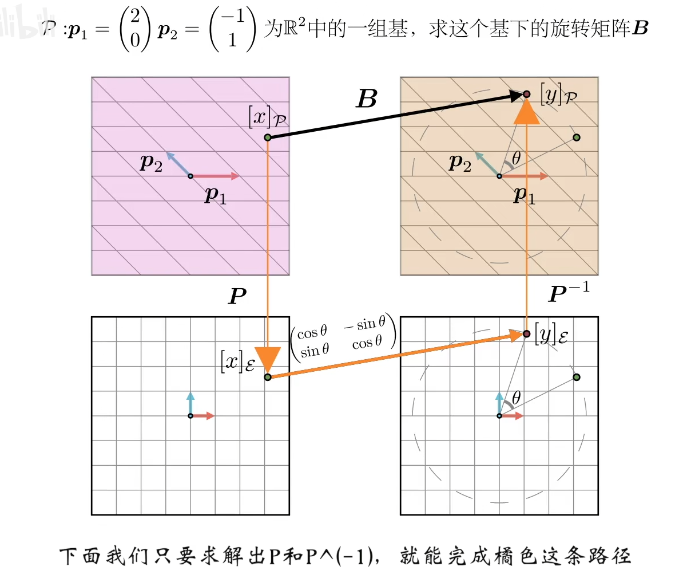

    ‍

[^15]: # 第六章 二次型

    ‍

[^16]: # 线性代数的几何意义

    <iframe src="/widgets/The geometric meaning of linear algebra/" data-subtype="widget" border="0" frameborder="no" framespacing="0" allowfullscreen="true"></iframe>

    # 线性代数的几何意义

    [线性代数的几何意义--图解线性代数.pdf](assets/线性代数的几何意义--图解线性代数-20260504161428-a294rso.pdf)

    

                            
                            <main class="kg-card-main">
                                

                                    

                                        <a class="kg-bookmark-container" href="https://www.bilibili.com/video/BV1ib411t7YR/?spm_id_from=333.788.videopod.episodes&amp;vd_source=42bec97100a0d831cda9a1c7895b2cb1">
                                            

                                                
-UP主汉语配音-【线性代数的本质】合集-转载于3Blue1Brown官方双语】_哔哩哔哩_bilibili

                                                
-UP主汉语配音-【线性代数的本质】合集-转载于3Blue1Brown官方双语】共计15条视频，包括：00-序言、01-向量究竟是什么、02-线性组合.张成的空间与基等，UP主更多精彩视频，请关注UP账号。

                                                

                                                    
                                                    婆婆町
                                                    https://www.bilibili.com
                                                

                                            

                                            

                                                    
                                                

                                        </a>
                                    

                                

                            </main>
                        

    考完研后记得将线代的笔记上传保存为电子版，之后工作也可能继续用到线性代数

    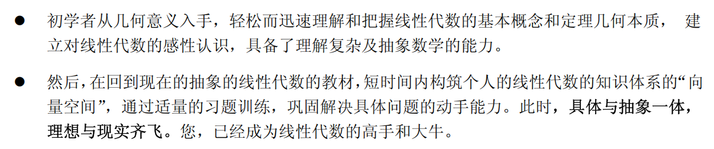

    # 1.向量

    

                            
                            <main class="kg-card-main">
                                

                                    

                                        <a class="kg-bookmark-container" href="https://www.bilibili.com/video/BV1ib411t7YR/?spm_id_from=333.788.videopod.episodes&vd_source=42bec97100a0d831cda9a1c7895b2cb1&p=2">
                                            

                                                
01-向量究竟是什么_哔哩哔哩_bilibili

                                                
01-向量究竟是什么是-UP主汉语配音-【线性代数的本质】合集-转载于3Blue1Brown官方双语】的第2集视频，该合集共计15集，视频收藏或关注UP主，及时了解更多相关视频内容。

                                                

                                                    
                                                    婆婆町
                                                    https://www.bilibili.com
                                                

                                            

                                            

                                                    
                                                

                                        </a>
                                    

                                

                            </main>
                        

    物理视角——向量是二维箭头，三维箭头（具有长度&方向两个属性）

    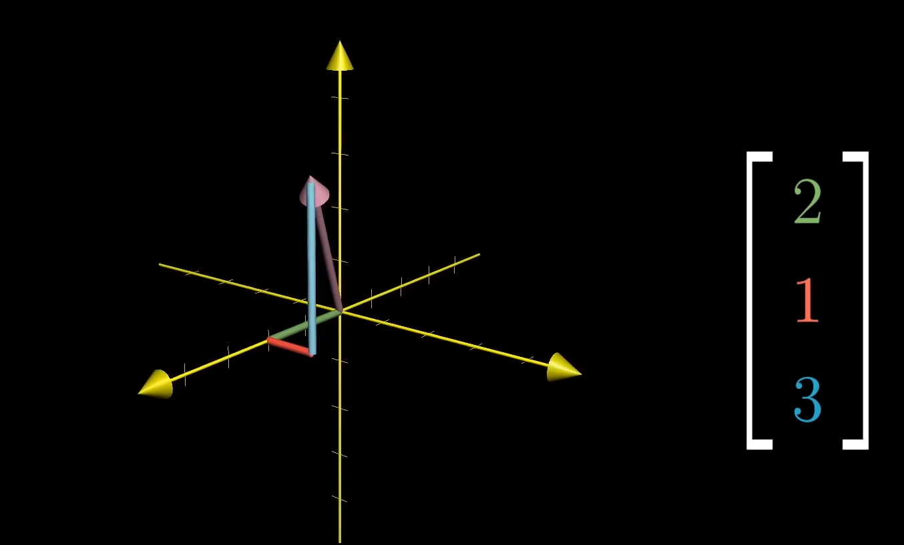

    计算机视角——向量是列表，具有不同属性，如下面的**多属性信息包**。

    ## 从第一性原理看：向量的本质是什么？

    向量最底层可以理解成：

    > **一组有顺序的数，用来描述某个对象在多个方向/属性上的分量。**
    >

    你可以把高维向量理解为：​**多属性信息包**。

    比如描述一个学生：

    $$
    (身高, 体重, 数学成绩, 英语成绩, 跑步成绩)
    $$

    这就是一个五维向量。

    例如：

    $$
    (175,70,130,120,12.5)
    $$

    它不是物理空间里的箭头，但它仍然是一个向量。

    因为它满足向量的基本运算：

    $$
    (175,70,130,120,12.5)+(180,75,125,118,13.0)
    $$

    可以相加。

    也可以数乘：

    $$
    2(175,70,130,120,12.5)
    $$

    也可以算距离、相似度、夹角。

    所以：

    > **高维向量不是“空间中看不见的箭头”，而是“多个维度上的数值组合”。**
    >

    ## “维度”不一定是空间方向，也可以是属性

    二维、三维里的维度通常是空间方向：

    $$
    x,y,z
    $$

    但高维里的“维度”可以是任何独立特征。

    比如一个人可以表示成：

    $$
    (年龄, 身高, 体重, 收入, 睡眠时间, 学习时长)
    $$

    一篇文章可以表示成：

    $$
    (词语1出现次数, 词语2出现次数, 词语3出现次数,\cdots)
    $$

    一张图片可以表示成：

    $$
    (像素1亮度, 像素2亮度, 像素3亮度,\cdots)
    $$

    一个机器学习里的词向量甚至可能是：

    $$
    (0.12,-0.35,0.88,\cdots)
    $$

    它可能有 300 维、768 维、甚至更多。

    所以高维向量在现实里非常常见，只是它们不再是几何上能直接看见的箭头，而是​**信息的坐标化表达**。

    # 2.线性组合 张成的空间与基

    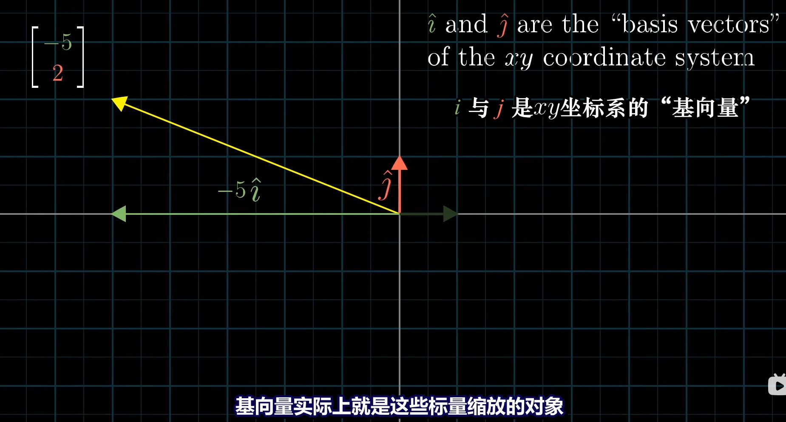

    任意两组线性无关的向量即可表示平面上的所有向量

    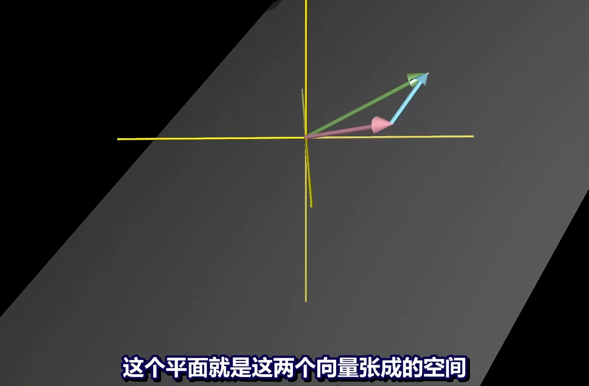

    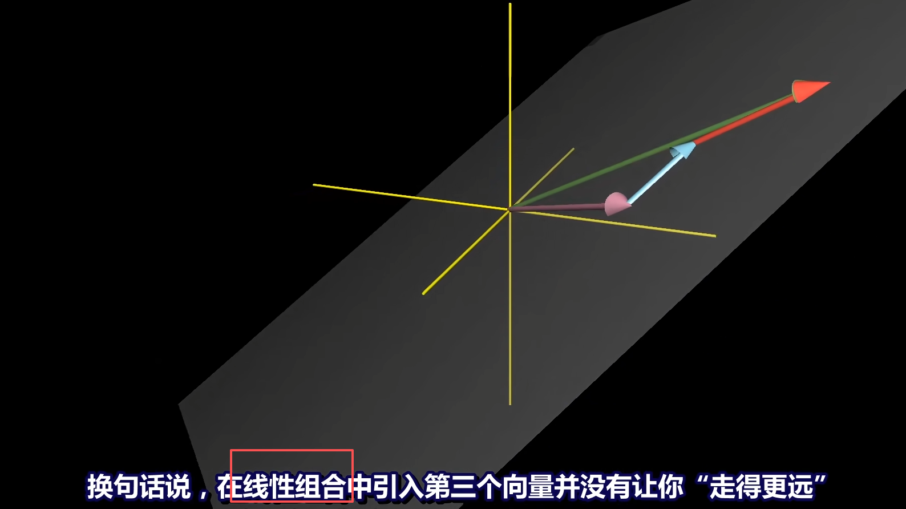

    # 3.矩阵与线性变换

    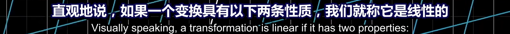

    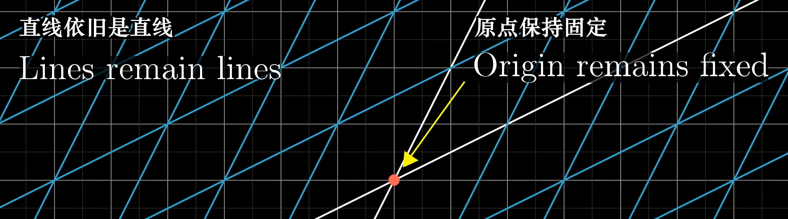

    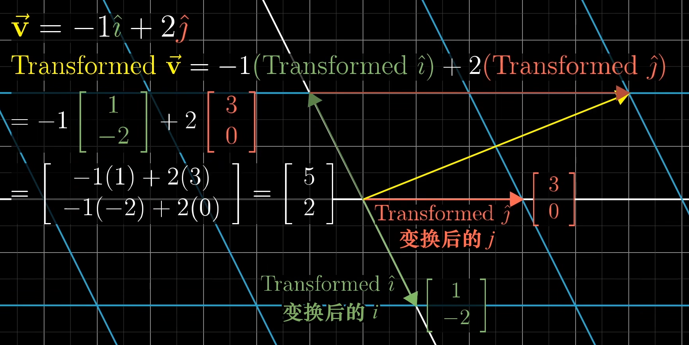

    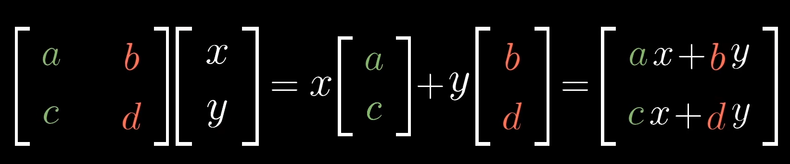

    a,c&b,d看成基向量，xy看成线性组合相乘得那个系数，得到的结果就是变换后的向量

    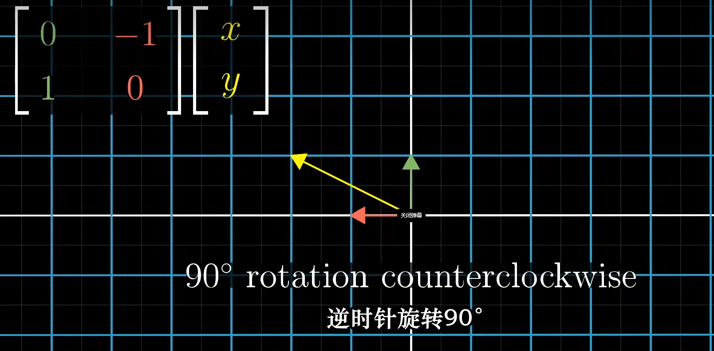

    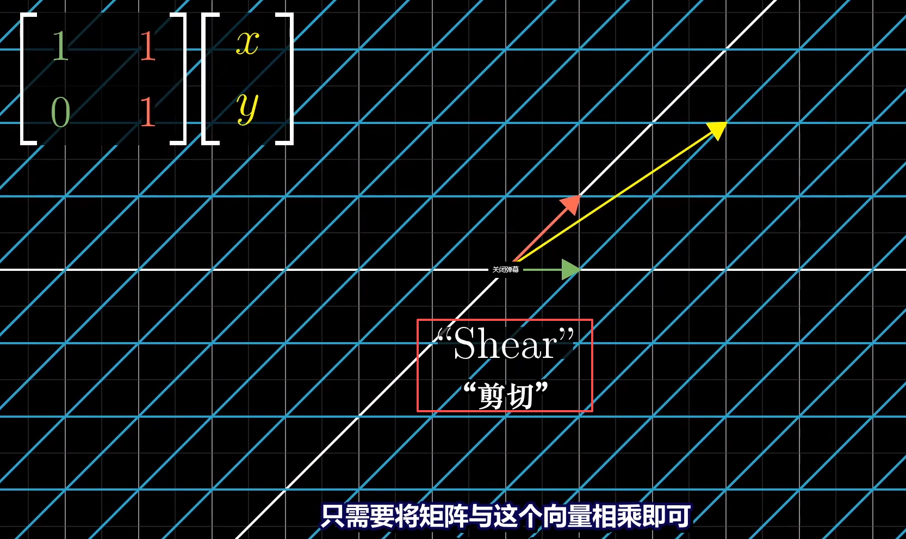

    # 4.矩阵乘法与线性变换复合的联系

    先旋转再剪切，这两个矩阵作用的空间变换跟右边那个复合矩阵作用得到的结果一样。

    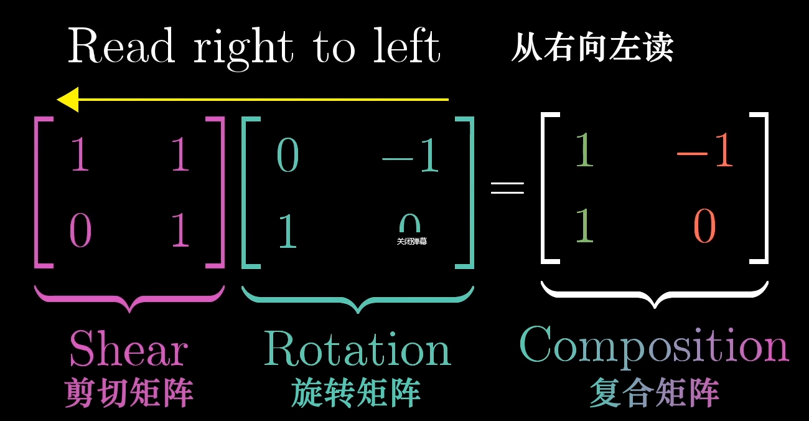

    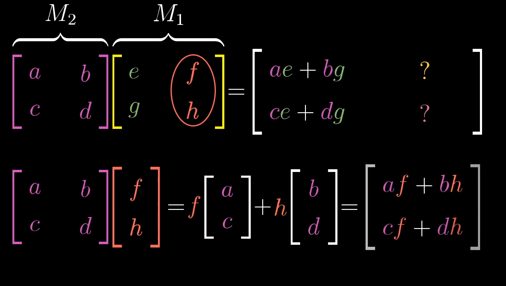

    # 5.行列式

    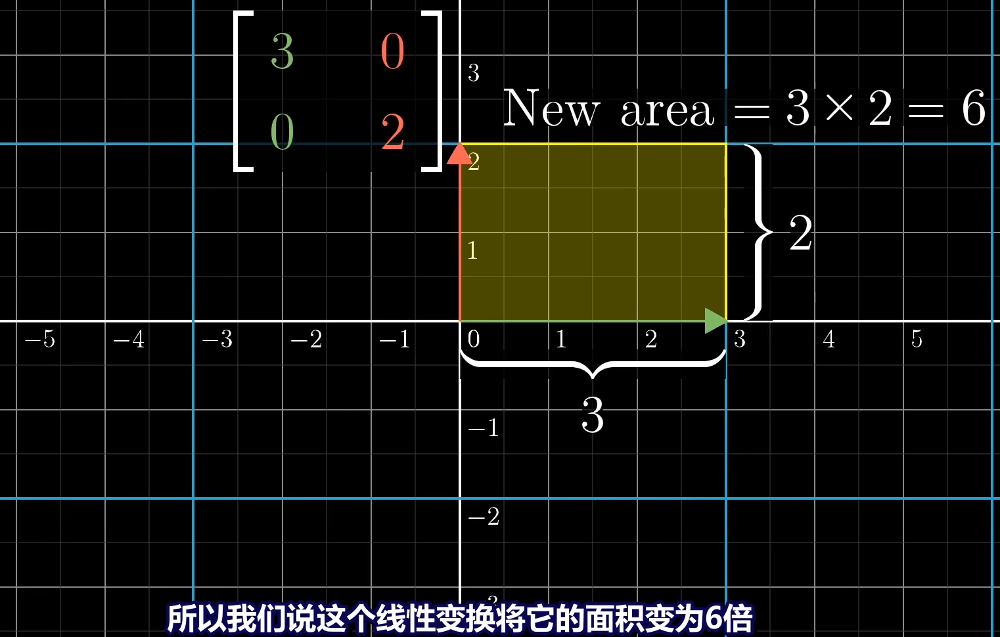

    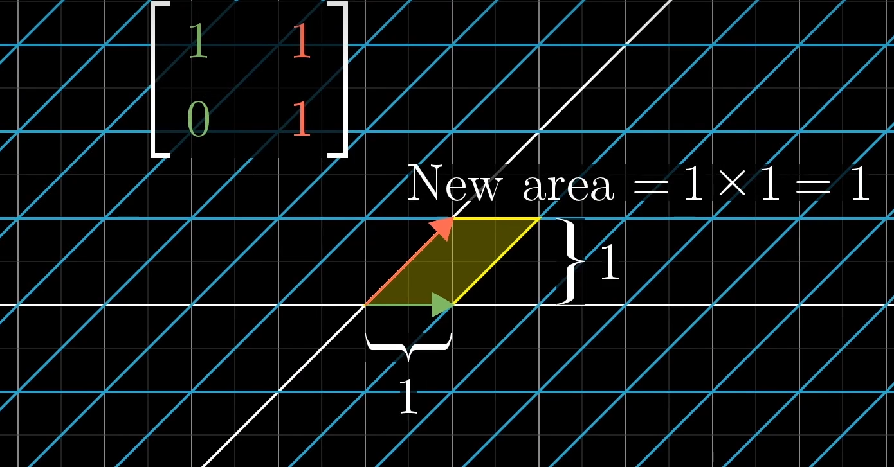

    发生空间定向改变时，行列式为负！

    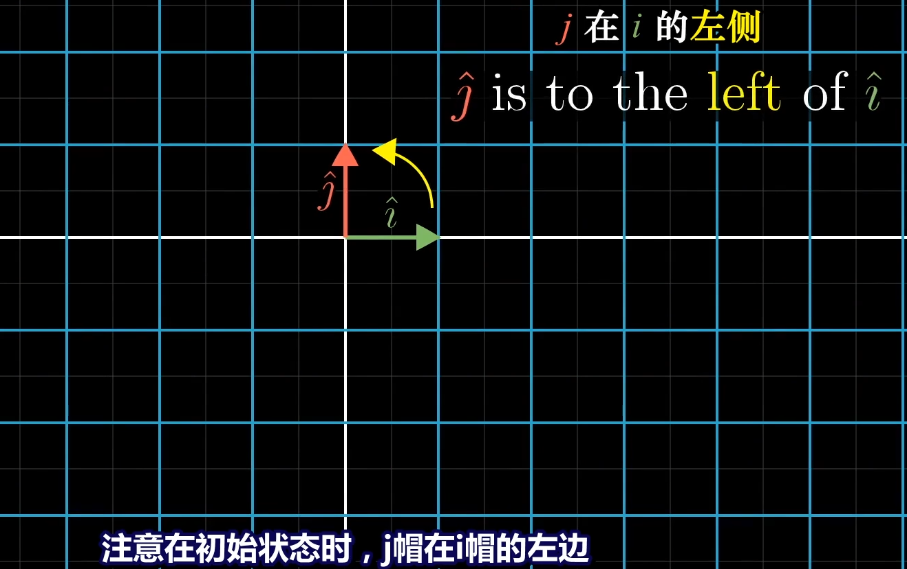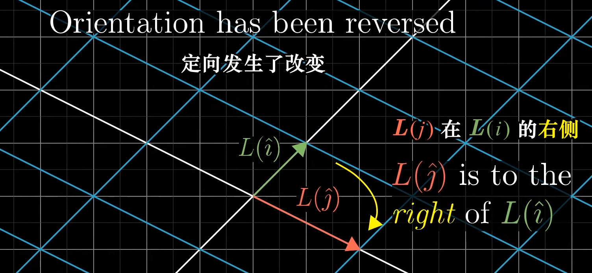

    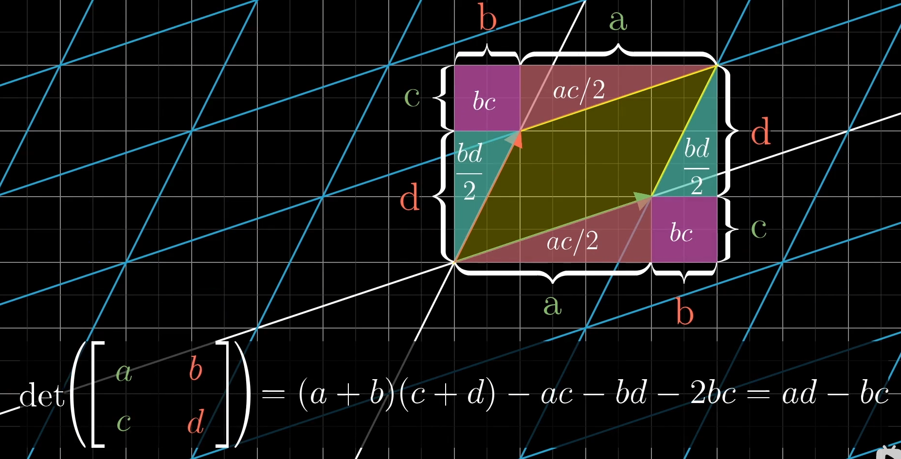

    ‍

    # 6.逆矩阵、列空间、秩与零空间

    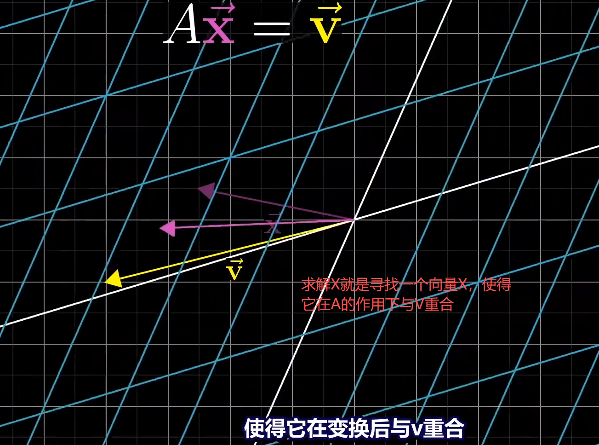

    矩阵的逆，逆变换就是将​变换后的结果恢复到原来的样子

    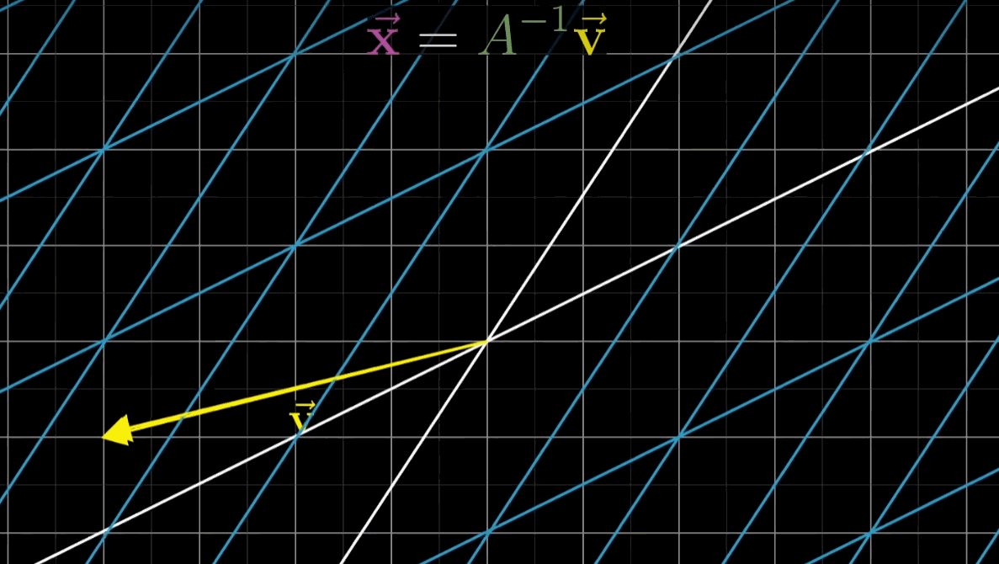

    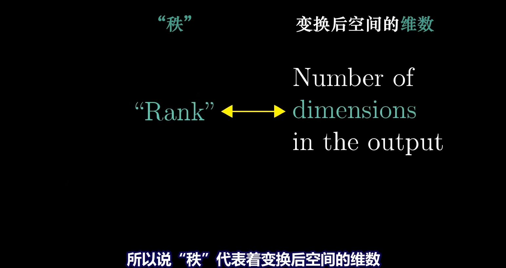

    # 7.🌟特征值与特征向量

    

                            
                            <main class="kg-card-main">
                                

                                    

                                        <a class="kg-bookmark-container" href="https://www.bilibili.com/video/BV1ib411t7YR?spm_id_from=333.788.videopod.episodes&vd_source=42bec97100a0d831cda9a1c7895b2cb1&p=14">
                                            

                                                
10-特征向量与特征值_哔哩哔哩_bilibili

                                                
10-特征向量与特征值是-UP主汉语配音-【线性代数的本质】合集-转载于3Blue1Brown官方双语】的第14集视频，该合集共计15集，视频收藏或关注UP主，及时了解更多相关视频内容。

                                                

                                                    
                                                    婆婆町
                                                    https://www.bilibili.com
                                                

                                            

                                            

                                                    
                                                

                                        </a>
                                    

                                

                            </main>
                        

    ‍

[^17]: # 线代强化复习参考

    1. 姜晓千强化讲义
    2. 姜晓千基础讲义
    3. 张宇30讲线代部分
    4. 《1000》A组&B组
    5. 880强化部分

    ‍

    ‍
